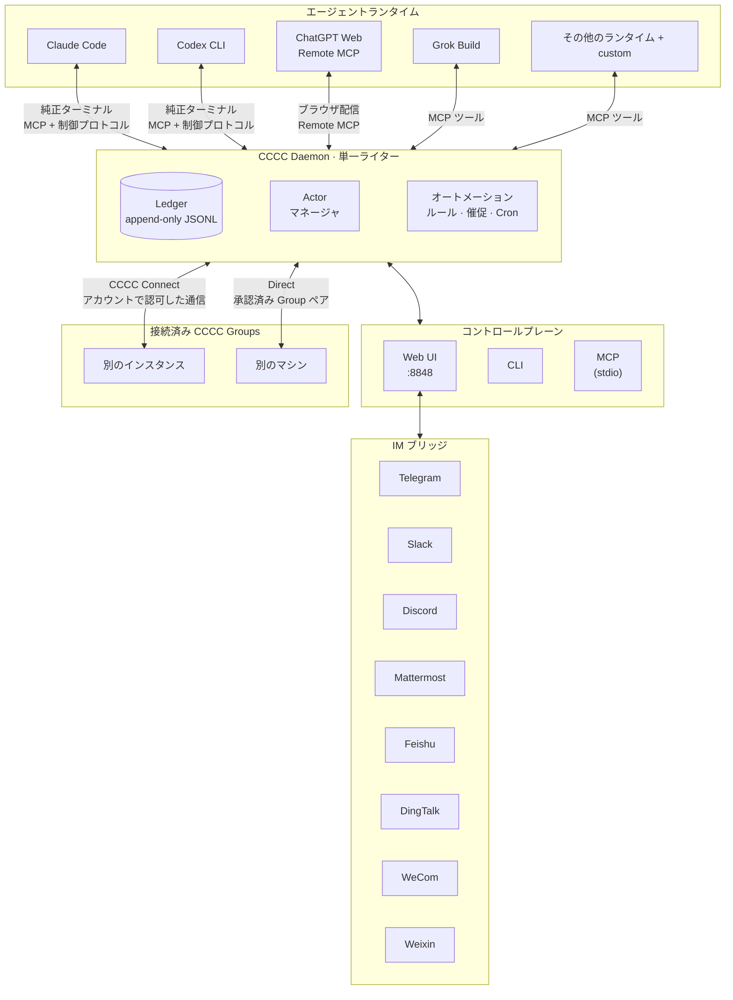

<div align="center">


# CCCC

### コーディングエージェントをグループチャットのように指揮する

**既読・送達トラッキング・インスタンス間連携・スマホ運用 —
Claude Code、Codex、ChatGPT Web などの対応ランタイムをひとつの永続グループで。**

複数のコーディングエージェントを、ランタイム・マシン・信頼済み working group をまたぐ**永続的で協調されたチーム**として運用 — バラバラのターミナルセッションではなく。

インストールコマンドひとつ。Rust ツールチェーンも追加インフラも不要です。

[](https://pypi.org/project/cccc-pair/)
[](Cargo.toml)
[](LICENSE)
[](https://chesterra.github.io/cccc/)

[English](README.md) | [中文](README.zh-CN.md) | **日本語**

</div>

---

<div align="center">

<a href="screenshots/overview.webp?raw=1" title="デスクトップ画像を原寸で表示"></a>
&nbsp;
<a href="screenshots/iphone.webp?raw=1" title="モバイル画像を原寸で表示"></a>

</div>

## なぜ CCCC か

複数のコーディングエージェントで作業するときは、タスクの担当者、メッセージの到達状況、再起動後も残る進捗を把握する必要があります。CCCC はそれらを一か所で管理し、ターミナルを離れていても Web や IM から確認・操作できます。

CCCC はエージェント群を、永続的で協調された 1 つのシステムとして運用します：

- **永続協調** — メッセージ履歴は append-only ledger に記録し、タスクと共有コンテキストもそれぞれ永続化します。
- **配信事実の可視化** — ルーティング、保存、runtime 配信、既読、返信を個別に記録し、「送信済み」を「確認済み」と扱いません。
- **1 つのコントロールプレーン** — Web UI、CLI、MCP、IM ブリッジがすべて同じ daemon 状態を共有します。
- **マルチランタイム前提** — Claude Code、Codex CLI、ChatGPT Web、Grok Build などの主要ランタイムを 1 つのグループで混在運用できます。
- **CCCC Connect によるインスタンス間連携** — 同一アカウント内の検出、承認済みの会員間 Group 接続、アカウント不要の Direct 接続に対応。各インスタンスの状態と権限境界を保ちます。
- **ローカルファースト運用** — インストールコマンドひとつで始められ、ランタイム状態は `CCCC_HOME` に置いたまま、必要時だけリモート監視へ広げられます。

## CCCC の役割

CCCC はコマンド一つで導入でき、データベースやメッセージブローカーの別途運用、Docker は不要です：

| 機能 | 実現方法 |
|---|---|
| **永続的なイベント履歴** | append-only ledger（`ledger.jsonl`）にメッセージと協調イベントを記録し、再生と監査に利用 |
| **信頼性のあるメッセージング** | Send / Send + Reply / Mail、配信・既読・返信の事実を分離し、Mail 専用 Inbox を ledger 順で消費 — runtime への引き渡しを既読と偽りません |
| **統一コントロールプレーン** | Web UI、CLI、MCP ツール、IM ブリッジがすべて 1 つの daemon に接続 — 状態の分断なし |
| **マルチランタイム編成** | 対応するランタイムを同じ Group で混在利用し、その他の CLI エージェントには `custom` を使用 |
| **CCCC Connect** | 自分のインスタンス、異なる会員の指定 Group、またはアカウントなしで二つの Group を直接接続 |
| **ワークスペースツール** | ファイルの閲覧・編集、Git 差分確認、Presentation への文書固定、タイル表示の純正ターミナル操作 |
| **音声ワークフロー** | Voice Secretary で音声を文書や入力欄の下書きに整理。実験的な Codex Voice はリアルタイム会話と Runtime を使う Analyst を連携 |
| **ロールベース協調** | Foreman + Peer ロールモデル、権限境界と宛先ルーティング（`@all`、`@peers`、`@foreman`） |
| **ローカルファーストなランタイム状態** | ランタイムデータはリポジトリではなく `CCCC_HOME` に保持しつつ、Web Access と IM ブリッジで遠隔運用も可能 |

## 0.4.40 の主な変更

- **三つの接続方法**：同一アカウントのインスタンス、会員間の指定 Group、アカウント不要の Direct Group 接続。入力欄の `#Group` 参照は Agent に正確な宛先を伝えます。
- **Files と Git**：コードや文書の閲覧、下書き・競合保護付きのデスクトップ編集、作業ツリーとステージ済み変更の確認。
- **安定した閲覧と移動**：コンパクトな Presentation、定期確認で点滅しない PDF、ページや Group の切り替えで保持されるターミナル、見やすいダークテーマと設定画面。
- **Mattermost のネイティブ対応**：専用 Bot によるメッセージ、ファイル、スレッド、逐次返信。
- **Runtime と設定の信頼性**：Profile 変換と秘密情報の保存再試行、Grok のネイティブ MCP 検証、ChatGPT の対話的ログイン、Voice の障害診断を改善。

旧手動 Group Bridge は廃止され、既存の権限は自動変換されません。過去のメッセージは引き続き閲覧できます。更新時の動作と全変更は [0.4.40 リリースノート](docs/release/v0.4.40_release_notes.md)を参照してください。

## クイックスタート

### インストール

```bash
# macOS / Linux（推奨）
curl -fsSL https://chesterra.github.io/cccc/install.sh | sh

# Windows CMD または PowerShell（推奨）
powershell.exe -NoProfile -ExecutionPolicy Bypass -Command "[Net.ServicePointManager]::SecurityProtocol = [Net.ServicePointManager]::SecurityProtocol -bor [Net.SecurityProtocolType]::Tls12; Invoke-RestMethod 'https://chesterra.github.io/cccc/install.ps1' | Invoke-Expression"

# pip 互換のネイティブ platform wheel
python -m pip install -U "cccc-pair>=0.4.36"
```

> **CCCC は単一のネイティブ Rust 実装を使用します。** Web サイトのインストーラーを
> 推奨します。pip はパッケージマネージャー互換用で、同じネイティブ実行ファイルを
> platform wheel として導入します。Python daemon、launcher、fallback は含みません。
> 対応対象は Linux x86-64（glibc 2.28+）、Apple Silicon macOS 11+、Windows
> x86-64 です。Intel Mac 対応は CCCC v0.4.37 が最終版で、それ以降は
> `x86_64-apple-darwin` artifact を公開しません。

### アップグレード

```bash
# Web サイトインストーラーが所有する場合
cccc update

# pip が管理する場合
python -m pip install -U "cccc-pair>=0.4.36"
```

`cccc update --check` はチャネルの最新バージョン、インストールの所有者、ネイティブ
プラットフォームの要件を確認します。pip 管理下でも利用でき、インストールや稼働中の
サービスを変更しません。`--offline` を追加すると通信せずローカル情報のみ表示します。
pip 管理下のコマンドは standalone 自己更新を引き続き拒否し、代わりに
パッケージマネージャーのコマンドを表示します。どちらも同じネイティブ製品を
導入しますが、ファイルは作成元のインストーラーが管理し続けます。pip で更新する
前に `cccc daemon stop` を実行し、foreground の CCCC process も終了してください。
特に Windows では executable の置換に必要です。同じコマンドディレクトリを pip
から Web サイトインストーラーへ切り替える場合は、先に
`python -m pip uninstall cccc-pair` を実行してください。
`CCCC_ALLOW_REPLACE_EXISTING=1` を設定しても、pip 管理下のファイルは上書きしません。

旧版の `cccc update` が `0.4.35` のままなら、そのインストールを所有する Python 環境で
上記の最低バージョンを指定した pip コマンドを実行してください。`0.4.35` は汎用 Python
パッケージを提供する最終版です。非対応環境では、バージョン指定のない pip 更新が再び
この版を選ぶことがあります。最低バージョンの指定により不一致を明示的なエラーにできます。
詳しくは [更新 FAQ](https://chesterra.github.io/cccc/guide/faq#why-does-an-older-cccc-update-stay-on-0-4-35) を参照してください。

### 起動

```bash
cccc
```

**http://127.0.0.1:8848** を開く — デフォルトで daemon とローカル Web UI が一緒に起動します。
`localhost`／`127.0.0.1` から直接利用する場合はパスワード不要で、Access Token も作成しません。LAN、Remote Access、公開 URL、リバースプロキシ経由の利用には明示的な管理者 Token が必要です。

```bash
cccc status            # 製品、daemon、group、actor、agent runtime を表示
cccc doctor            # インストールと実行環境を診断
cccc daemon status     # daemon のライフサイクル状態を明示的に確認
```

`cccc python`、`cccc rust`、旧 `ccccd` alias は廃止されました。既存の自動化は
`cccc daemon ...` を使用してください。daemon の状態ファイル名は互換性のため維持し、
Python runtime なしで 0.4.35 home を引き継げます。

### マルチエージェントグループの作成

利用するエージェント CLI を先にインストールし、ログインしてください。以下は Claude Code と Codex CLI の例です。

```bash
cd /path/to/your/repo
cccc attach .                              # ディレクトリを scope として紐付け
cccc setup --runtime claude                # この例で使うランタイムだけを準備
cccc setup --runtime codex
cccc actor add foreman --runtime claude    # 最初の actor が foreman に
cccc actor add implementer --runtime codex # peer を追加
cccc group start                           # 全 actor を起動
cccc send "リポジトリを確認し、最初の安全なタスクを提案してください。" --to foreman
cccc tracked-send "最初の具体タスクを担当し、検証証拠を添えて返信してください。" \
  --to implementer \
  --title "最初の具体タスク" \
  --outcome "変更内容と検証証拠が報告されている"
```

これで 2 つのエージェントが永続グループ内で協調し、完全なメッセージ履歴、到達追跡、Web ダッシュボードを備えた状態になります。配信と協調は daemon が担い、ランタイム状態はリポジトリではなく `CCCC_HOME` に残ります。

**この時点で見えるはずのもの:** http://127.0.0.1:8848 の Web UI で両方の actor が実行中になり、foreman の返信が**チャット**に届き、tracked リクエストのメッセージに送達・既読ステータスが表示されます。actor が停止したままの場合は、まず `cccc doctor` でランタイムを確認し、よくある初回トラブルは [FAQ](https://chesterra.github.io/cccc/guide/faq) を参照してください。

## プログラマブル連携（SDK）

外部アプリやサービスから CCCC を連携する場合は、公式 SDK を利用してください:

```bash
pip install -U cccc-sdk
npm install cccc-sdk
cargo add cccc-sdk
```

SDK には daemon は含まれません。実行中の `cccc` 本体に接続して利用します。

## アーキテクチャ



**設計上の重要な決定：**

- **Daemon が共有協調を管理** — Actor のライフサイクル、配信、協調状態の変更を同じコントロールプレーンで処理
- **Ledger は append-only** — 過去のイベントを書き換えず、新しいイベントで変化を記録。Group 設定とコンテキストはそれぞれ別の正本を持ちます
- **入口はコントロールプレーンを共有** — Web、CLI、MCP、IM の協調操作は daemon を経由。Web はブラウザ・音声・IM 連携サービスも実行します
- **インスタンスの権限は独立** — アカウントとデバイスの関連付け、または承認済み Direct Group 権限が通信を許可。Web 閲覧は各対象が別途認可します
- **ランタイムホーム `CCCC_HOME`**（デフォルト `~/.cccc/`）— ランタイム状態はリポジトリの外に保持

## サポートランタイム

CCCC は 18 種の組み込み Runtime 連携と、その他の CLI エージェント向けの `custom` に対応します。同じ Group の Actor が異なる Runtime を使えます。操作方法と設定要件は Runtime ごとに異なります：

| ランタイム | 連携方式 | 入口 / サーフェス |
|-----------|----------|-------------------|
| Claude Code | 管理 Agent View セッション + 純正 TUI、セッション単位 MCP | `claude` |
| Cline CLI | MCP 自動設定 | `cline` |
| Codex CLI | 管理 app-server セッション + 純正 TUI、Actor 単位 MCP | `codex` |
| DeepSeek Harness | 管理 ACP 開発者プレビュー、純正ターミナルなし | CCCC 管理の `dsh-acp-demo` |
| GitHub Copilot CLI | MCP 自動設定 | `copilot` |
| Cursor CLI | プロンプト支援 MCP 設定 | `cursor-agent` |
| Devin CLI | MCP 自動設定 | `devin` |
| Kiro CLI | MCP 自動設定 | `kiro-cli` |
| Kilo Code CLI | 管理 ACP セッション + 純正 TUI、セッション単位 MCP | `kilo` |
| Antigravity CLI | MCP 自動設定 | `agy` |
| ChatGPT Web | Remote MCP + ブラウザ配信 | `chatgpt.com` の会話 |
| Grok Build | 管理 ACP セッション + 純正 TUI、自動 MCP 設定 | `grok` |
| Hermes Agent | MCP 自動設定 | `hermes` |
| Droid | MCP 自動設定 | `droid` |
| Amp | MCP 自動設定 | `amp` |
| Auggie | MCP 自動設定 | `auggie` |
| Kimi Code | MCP 自動設定 | `kimi` |
| OpenCode | 管理 ACP セッション + 純正 TUI、セッション単位 MCP | `opencode` |
| Custom | 手動設定 | 任意のコマンド |

ここでは安定したランタイムの入口または利用サーフェスのみを示します。CCCC はランタイムごとの起動デフォルトを自動適用し、actor/profile のコマンドは設定で確認・変更できます。[サポートランタイムガイド](https://chesterra.github.io/cccc/guide/runtimes) には、`agy --dangerously-skip-permissions`、`grok --always-approve`、`opencode --auto` など、承認を省略する既定の autonomy flags も記載しています。

```bash
cccc setup --runtime claude       # CCCC のセッション単位 MCP 注入を確認
cccc setup --runtime cline        # Cline 純正 TUI の MCP を自動設定
cccc setup --runtime cursor       # プロンプト支援 MCP 設定コントラクトを表示
cccc setup --runtime kilo         # CCCC のセッション単位 MCP 注入を確認
cccc setup --runtime antigravity  # Actor 起動前に Antigravity MCP を自動設定
cccc runtime list --all           # 利用可能なランタイムを表示
cccc doctor                       # 環境とランタイムの可用性を検証
```

Antigravity の設定時には、自動配信された端末入力を評価アンケートが消費しないよう、ユーザー設定でアンケートを無効にします。他の設定は保持されます。同じユーザーが単独で起動する AGY にも適用されます。

Runtime を選ぶと、CCCC が操作方法を自動的に決定します。Claude Code、Codex CLI、Grok Build、OpenCode、Kilo は、同じ provider session で純正の書き込み可能なターミナルと構造化プロトコルを併用します。メッセージはそのターミナルへ渡され、steer と queue は受信 Runtime が判断します。DeepSeek Harness は純正ターミナルなしの ACP、ChatGPT Web はブラウザ配信と Remote MCP を使用します。

各サポート Runtime の setup コマンド、操作方式、トラブルシュートは [サポートランタイムガイド](https://chesterra.github.io/cccc/guide/runtimes) を参照してください。

### ChatGPT Web をローカル開発 actor として

CCCC は Group メッセージを紐付けた ChatGPT 会話へ届けます。connector 対応の ChatGPT セッションは、Actor に紐付いた Remote MCP を通じてメッセージの受信、返信、リポジトリの閲覧・編集、scope 内の shell/git 実行ができます。現在、Web Model Actor はインスタンスごとに一つです。

セットアップには MCP connector 用の public HTTPS URL（Cloudflare Tunnel、ngrok、Tailscale Funnel、またはリバースプロキシ）が必要です。CCCC は安定したテキストのみの配信を既定とし、実験的な **GPT Pro** モードも提供します。このモードは、画像添付によって第三者 MCP が利用可能になる一部アカウント向けに、ごく小さな空白 PNG を各配信へ添付します。CCCC はモデルを切り替えず、ChatGPT の変更後もこの互換手段が動作し続けることを保証しません。詳細な設定とトラブルシュート: [ChatGPT Web Model Runtime](https://chesterra.github.io/cccc/guide/web-model-runtime)。

## CCCC Connect：インスタンスとチームをつなぐ

作業に合う接続範囲を選びます：

| 方法 | 範囲と設定 |
|---|---|
| **同一アカウント** | **設定 → アカウント** で各インスタンスを関連付けると、Group ごとの手動ペアリングなしで検出・通信できます。 |
| **異なる会員** | サイドバーの Group の **⋮ → Group 接続** または Group 設定から Member ID を招待し、双方がアカウントサイトで自分の Group を確認します。 |
| **Direct、アカウント不要** | **Group 接続 → 直接接続** で信頼できる経路から招待を交換し、指定 Group の接続を承認します。一方が到達可能な LAN、VPN、既存のネットワーク経路で接続を受け付ける必要があります。 |

状態と履歴は各インスタンスに残ります。会員間接続と Direct は指定 Group 間のメッセージ、返信、小さなファイルを許可し、ターミナル、ワークスペース閲覧、任意ツールは公開しません。Direct に公開 Web 管理画面は不要で、ネットワークリレーも提供しません。

管理者はサイドバーから同一アカウントのリモートワークスペースを開けますが、**各対象インスタンス自身の管理者 Access Token** と到達可能な HTTPS アドレスが必要です。制限付きアクセスは単一インスタンスに留まり、Web の権限とバックグラウンド連携の権限は独立しています。

Agent は `cccc_connect` で対象を検出し、`cccc_message_send` または `cccc_file` に `dst_instance_id` と `dst_group_id` を指定します。返信には受信したローカル Event ID を使います。入力欄でリモート **`#Group`** を選ぶと、ローカル Agent に正確な識別情報を渡せます。それだけでリモート送信や権限付与は行いません。詳しくは [CCCC Connect ガイド](https://chesterra.github.io/cccc/guide/connect)を参照してください。

## メッセージングと協調

CCCC は IM グレードのメッセージングセマンティクスを実装 — 「ターミナルにテキストを貼り付ける」だけではありません：

- **宛先ルーティング** — `@all`、`@peers`、`@foreman`、または特定の actor ID
- **明示的な 3 モード** — Send は能動配信、Send + Reply は具体的な返信要求、Mail は即時中断なしの Inbox 配信
- **事実の分離** — `runtime.delivery`、Mail 既読カーソル、返信、取消、タスク完了は互いを代用しません
- **消費型 Inbox 読取** — `cccc_inbox_read` が次の順序付き Mail バッチを返し、Mail カーソルを原子的に進めます
- **返信と引用** — 構造化された `reply_to` + 引用コンテキスト
- **返信要求** — Send + Reply は受信者の返信または送信者の取消まで追跡
- **ライフサイクル境界** — paused、stopped、disabled の actor を配信が暗黙に起動することはありません
- **明確な宛先識別** — Connect は instance と Group の両 ID を使用し、ローカル ID との混同を防ぎます。

待てる有用な agent 向け情報には Mail、遅延の損失が中断コストを上回る場合は Send、さらに具体的な回答が必要な場合だけ Send + Reply を使います。Mail は人間の user には送れません。1 件のメッセージは `user` のみ、または 1 人以上の agent のどちらか一方を宛先とし、両者へ必要な場合は別々に送信します。明確な担当者、完了条件、証拠、引き継ぎ、受け入れ履歴が必要な委任作業には `tracked-send` を使ってください。`@all` は告知や緊急の共有制約には使えますが、具体タスクのデフォルト分配先にはしません。

能動配信は daemon 管理のパイプラインを通り、その `runtime.delivery` 事実は Inbox の既読状態や返信とは分離されます。

## オートメーションとポリシー

少数の配信タイマーと自動化ルールが運用面を処理し、すべてのメッセージを prompt に変えることを避けます：

| ポリシー | 機能 |
|----------|------|
| **Mail 通知** | 宛先が明確な Mail に対し、設定時間後に本文なしの通知を最大 1 回送信 |
| **返信通知** | 配信済みの Send + Reply が未返信の場合に最大 1 回通知 |
| **Actor アイドル検出** | agent が沈黙した際に foreman に通知 |
| **Keepalive** | foreman への定期的なチェックインリマインダー |
| **沈黙検出** | グループ全体が静かになった場合にアラート |

内蔵ポリシーに加え、カスタムオートメーションルールを作成可能：

- **インターバルトリガー** — 「N 分ごとにスタンドアップリマインダーを送信」
- **Cron スケジュール** — 「平日毎朝 9 時にステータスチェックを投稿」
- **ワンタイムトリガー** — 「今日 17 時にグループを一時停止」
- **運用アクション** — グループ状態の設定や actor ライフサイクルの制御（管理者のみ、ワンタイムのみ）

## Web UI

組み込み Web UI `http://127.0.0.1:8848` では以下を利用できます：

- **メッセージ** — `@Actor` と `#Group` の補完、返信、検索、独立した配信・既読・返信状態
- **タイル表示の純正ターミナル** — 直接入力、ページ移動、Group 切り替え時の最近の表示の保持
- **Files と Git** — ワークスペース閲覧、コード・文書・メディアのプレビュー、デスクトップでの編集・ファイル管理。Git 変更は読み取り専用
- **Presentation** — 四つのコンパクトな固定スロット、拡大表示、ズーム、引用
- **Group と Actor 管理** — ライフサイクル操作、Runtime Profile の関連付け・Custom 設定、秘密の環境変数
- **オートメーション編集** — トリガー、スケジュール、アクションの視覚的な設定
- **Project Context** — 共有の協調情報、タスク、Agent 状態、自己進化スキル
- **Group Space** — NotebookLM による共有ナレッジ管理
- **ChatGPT Web Model 設定** — 一つの ChatGPT Web 会話を CCCC Actor として接続
- **Voice Secretary と Codex Voice** — 音声から文書・入力欄の下書きを作成し、実験的なリアルタイム Voice では Analyst を保持
- **CCCC Connect 設定** — アカウント経由の検出、指定 Group の接続、Direct ペアリング
- **IM ブリッジ設定** — Telegram、Slack、Discord、Mattermost、Feishu、DingTalk、WeCom、Weixin
- **設定** — メッセージポリシー、配信調整、ターミナル履歴
- **文字サイズ** — 90% / 100% / 125% をブラウザごとに保存
- **ライト／ダーク／システム連動テーマ**

### リモートアクセス

localhost からの直接利用に Access Token は不要です。他のマシンへ Web を公開する前に、**設定 → Web Access** で **Admin Access Token** を作成してください。リモートアクセスには認証が必要です。ローカルでの初回設定にブートストラップコードは不要ですが、リモートでの初回設定にはホストを管理できることの証明が必要です。

- **LAN／プライベートネットワーク** — Web Access に保存したバインド設定、または `cccc --host 0.0.0.0 --port 8848` を使用します。WSL2 の既定 NAT 環境では、LAN からのアクセスにミラーネットワークまたは Windows の転送・ファイアウォール設定も必要です。
- **既存のトンネルやリバースプロキシ** — 例えば `cloudflared tunnel --url http://127.0.0.1:8848` で HTTPS 公開します。プロキシ側で転送ヘッダーを保護し、[Web アクセスガイド](https://chesterra.github.io/cccc/guide/web-ui#security)に従ってください。
- **管理 Remote Access（CLI：`reach`）** — **設定 → アカウント** で関連付け、**Web Access** で有効化します。ローカルでの関連付けは既存の認証情報を保ちながら管理者アクセスを準備します。管理ヘルパーは現在 Linux と macOS に対応し、Windows は対象外です。Windows では外部トンネルやリバースプロキシを利用できます。

```bash
cccc login
cccc reach on
cccc reach status
cccc reach off
```

バインド設定の保存後は、**Apply now** で CCCC 管理の Web を再起動するか、外部のプロセスマネージャーを再起動します。明示的な `--host`／`--port` は保存済み設定より優先され、保存済み設定は `CCCC_WEB_HOST`／`CCCC_WEB_PORT` より優先されます。

Remote Access は固定版の `cloudflared` を `CCCC_HOME` に導入し、リポジトリや ledger はアップロードしません。Direct Group 接続は別の daemon 間通信経路で、Web 管理画面の公開は不要です。

## IM ブリッジ

Working Group を IM プラットフォームにブリッジ：

```bash
cccc im set telegram --token-env TELEGRAM_BOT_TOKEN
cccc im start
```

| プラットフォーム | ステータス |
|-----------------|-----------|
| Telegram | ✅ 対応済み |
| Slack | ✅ 対応済み |
| Discord | ✅ 対応済み |
| Mattermost | ✅ 対応済み |
| Feishu / Lark | ✅ 対応済み |
| DingTalk | ✅ 対応済み |
| WeCom / 企業微信 | ✅ 対応済み |
| Weixin / 微信 | ✅ 対応済み |

> Telegram、Slack、Discord、Mattermost、Feishu、DingTalk、WeCom は段階的な返信に対応し、長すぎる結果は欠落のない分割済み最終メッセージへフォールバックします。Weixin は欠落のない最終メッセージを配信し、現在はボットとのダイレクトチャットのみ対応しています。

通常のテキストや `/send @foreman <メッセージ>` で協調し、`/status` で Group 状態を確認、`/pause`／`/resume` でそのチャットの購読を一時停止・再開できます。Mattermost コマンドには `@botname` を付けます（例：`@cccc_bot /status`）。[Mattermost 設定ガイド](https://chesterra.github.io/cccc/guide/im-bridge/mattermost)を参照してください。

## CLI リファレンス

```bash
# ライフサイクル
cccc                           # daemon + Web UI を起動
cccc daemon start|status|stop  # daemon 管理

# グループ
cccc attach .                  # カレントディレクトリを紐付け
cccc groups                    # 全グループを一覧
cccc use <group_id>            # アクティブグループを切り替え
cccc group start|stop          # 全 actor を起動/停止

# Actor
cccc actor add <id> --runtime <runtime>
cccc actor start|stop|restart <id>

# メッセージング
cccc send "メッセージ" --to foreman
cccc tracked-send "委任作業" --to implementer --title "タスクタイトル" --outcome "完了条件"
cccc send "告知" --to @all  # 明示的なブロードキャスト
cccc reply <event_id> "返信"
cccc tail -n 50 -f             # ledger をリアルタイム追跡

# 受信箱
cccc inbox --actor-id <id>     # 次の未読 Mail バッチを読み取り、消費する

# 運用
cccc doctor                    # 環境チェック
cccc setup --runtime <name>    # MCP を設定
cccc runtime list --all        # 利用可能なランタイム

# IM
cccc im set <platform> --token-env <ENV_VAR>
cccc im start|stop|status
```

## MCP ツール

通常の Actor には `cccc_connect` を含むコンパクトな協調コアを常時公開します。その他の組み込みツールは、毎回ツールパック全体を公開せずに `cccc_capability_use` から呼び出せます。Web Model connector と専用アシスタントは役割ごとのツール範囲を持ちます。

| 機能面 | 例 |
|--------|----|
| **常時公開の協調コア** | `cccc_bootstrap`、`cccc_help`、機能検索・呼び出し、Inbox、メッセージ、ファイル、`cccc_context_get`、`cccc_coordination`、`cccc_task`、`cccc_agent_state` |
| **プロジェクト情報と記憶（必要時）** | `cccc_project_info`、`cccc_tracked_send`、`cccc_memory`、`cccc_context_sync` |
| **Group と Actor 制御（必要時）** | `cccc_group`、`cccc_actor`、`cccc_runtime_list` |
| **ワークスペースツール（必要時）** | `cccc_repo`、`cccc_presentation`、`cccc_terminal`、`cccc_debug` |
| **インスタンス検出** | `cccc_connect`、`cccc_message_send` と `cccc_file` の正確なインスタンス間宛先 |
| **その他の機能ツール** | `cccc_automation`、`cccc_space`、機能管理、`cccc_im_bind` |

協調コアは必要なプロトコルを維持し、ワークフローや推論方法、任意のツール選択は Agent と現在のタスクに委ねます。`cccc_help` は CCCC の状態、復旧、委任、機能ルートを調べるためのもので、一般的な推論・文章作成方法は規定しません。

## CCCC の位置づけ

| シナリオ | 適合度 |
|----------|--------|
| 複数のコーディングエージェントが 1 つのコードベースで協調 | ✅ コアユースケース |
| 人間 + エージェントの協調、完全な監査証跡付き | ✅ コアユースケース |
| 長時間稼働グループをスマートフォン/IM でリモート管理 | ✅ 強い適合 |
| マルチランタイムチーム（例：Claude + Codex + Kimi） | ✅ 強い適合 |
| 信頼済みグループがマシンやチームをまたいで協調 | ✅ 強い適合 |
| 単一エージェントのローカルコーディングヘルパー | ⚠️ 動作するが、CCCC の価値は複数参加者で発揮 |
| 純粋な DAG ワークフローオーケストレーション | ❌ 専用オーケストレーターを使用；CCCC は補完的に利用可能 |

CCCC は**協調カーネル** — 協調レイヤーを担い、外部の CI/CD、オーケストレーター、デプロイツールとの組み合わせを維持します。

## 他のアプローチとの比較

| すでに使っているもの | その強み | CCCC が加えるもの |
|---|---|---|
| **ネイティブのエージェントチーム**（例：Claude Code subagents/teams） | 単一ベンダー・単一セッション内で最もスムーズな連携 | ベンダー横断のグループ（Claude + Codex + Grok + Kimi…）、再起動後も残る状態、スマホ/IM からの運用、完全な監査 ledger |
| **並列タスクランナー**（worktree/タスクボード系ツール） | 隔離された並列タスク実行 | 協調レイヤー：エージェント同士が対話・引き継ぎ・割り込みレベルを選択し、有界なリマインダーを受ける — さらに 24/7 の daemon 運用 |
| **IM アシスタントゲートウェイ** | チャットアプリに住む個人アシスタント | 実作業向けの配信セマンティクス：tracked task、配信/既読/返信の事実、マルチエージェントグループ、永続監査証跡 |

CCCC はエージェントを置き換えるものではなく、それらをチームにするレイヤーです。詳しい議論: [FAQ — 他ツールとの比較](https://chesterra.github.io/cccc/guide/faq#how-does-cccc-compare-to-native-agent-teams-and-other-tools)

## セキュリティ

- **Web UI は高権限の入口です。** ローカル以外へ公開する前に Admin Access Token を作成し、公開アクセスには信頼できるトンネルやリバースプロキシによる HTTPS を使用してください。
- **Daemon IPC はアプリケーション認証のない、信頼されたローカルインターフェースです。** 利用可能な Unix socket または loopback TCP を使います。外部へ公開せず、ランタイムディレクトリを信頼できないユーザーと共有しないでください。
- **IM の認証情報** は環境変数の参照または直接値で設定できます。設定を共有する場合は参照を優先し、認証情報やランタイム状態を公開しないでください。
- **ランタイム状態** は `CCCC_HOME`（既定 `~/.cccc/`）に保持し、リポジトリと分離します。
- **接続範囲は明示的です。** 同一アカウントの関連付けは対象インスタンス間の連携を許可し、会員間と Direct の権限は指定 Group の組に限定されます。リモートワークスペースには各対象の管理者 Token が必要です。
- **Capability allowlist** は任意の MCP 機能を制御しますが、純正エージェントプロセスのサンドボックスではありません。Runtime 自体の権限と自律実行の既定値も確認してください。

脆弱性の報告は [SECURITY.md](SECURITY.md)、アクセス制御の操作は [Web UI ガイド](https://chesterra.github.io/cccc/guide/web-ui)を参照してください。

## ドキュメント

📚 **[完全なドキュメント](https://chesterra.github.io/cccc/)**

| セクション | 説明 |
|-----------|------|
| [クイックスタート](https://chesterra.github.io/cccc/guide/getting-started/) | インストール、起動、最初のグループ作成 |
| [ユースケース](https://chesterra.github.io/cccc/guide/use-cases) | 実践的なマルチエージェントシナリオ |
| [Web UI ガイド](https://chesterra.github.io/cccc/guide/web-ui) | ダッシュボードのナビゲーション |
| [CCCC Connect](https://chesterra.github.io/cccc/guide/connect) | アカウント・Direct 接続、配信と権限境界 |
| [Voice Secretary](https://chesterra.github.io/cccc/guide/voice-secretary) | 音声入力、文書、入力欄のワークフロー |
| [IM ブリッジ設定](https://chesterra.github.io/cccc/guide/im-bridge/) | Telegram、Slack、Discord、Mattermost、Feishu、DingTalk、WeCom、Weixin の接続 |
| [Group Space](https://chesterra.github.io/cccc/guide/group-space-notebooklm) | NotebookLM ナレッジ統合 |
| [ChatGPT Web Model Runtime](https://chesterra.github.io/cccc/guide/web-model-runtime) | MCP 対応 ChatGPT Web を CCCC actor として接続。任意の実験的 GPT Pro モードでは小さな空白 PNG を添付します |
| [Capability Allowlist](https://chesterra.github.io/cccc/guide/capability-allowlist) | MCP 機能ガバナンス |
| [ベストプラクティス](https://chesterra.github.io/cccc/guide/best-practices) | 推奨パターンとワークフロー |
| [FAQ](https://chesterra.github.io/cccc/guide/faq) | よくある質問 |
| [運用ランブック](https://chesterra.github.io/cccc/guide/operations) | 復旧、トラブルシューティング、メンテナンス |
| [CLI リファレンス](https://chesterra.github.io/cccc/reference/cli) | 完全なコマンドリファレンス |
| [SDK（Python/TypeScript/Rust）](https://github.com/ChesterRa/cccc-sdk) | 公式クライアントでアプリ/サービスから daemon を利用 |
| [アーキテクチャ](https://chesterra.github.io/cccc/reference/architecture) | 設計決定とシステムモデル |
| [機能詳細](https://chesterra.github.io/cccc/reference/features) | メッセージング、オートメーション、ランタイムの詳細 |
| [CCCS 標準](docs/standards/CCCS_V1.md) | 協調プロトコル仕様 |
| [Daemon IPC 標準](docs/standards/CCCC_DAEMON_IPC_V1.md) | IPC プロトコル仕様 |

## インストールオプション

### Web サイトインストーラー（推奨）

```bash
# macOS / Linux
curl -fsSL https://chesterra.github.io/cccc/install.sh | sh

# Windows CMD または PowerShell
powershell.exe -NoProfile -ExecutionPolicy Bypass -Command "[Net.ServicePointManager]::SecurityProtocol = [Net.ServicePointManager]::SecurityProtocol -bor [Net.SecurityProtocolType]::Tls12; Invoke-RestMethod 'https://chesterra.github.io/cccc/install.ps1' | Invoke-Expression"
```

GitHub Releases からチェックサム検証済みのネイティブ製品を取得し、同じ
インストーラーで `cccc update` できます。インストーラーは
自身が所有しない既存の `cccc`
コマンドを上書きしないため、意図的にアンインストールするか、別の
`CCCC_INSTALL_DIR` を指定してください。
別ディレクトリにある同名コマンドは変更しません。デフォルトのインストール先では、
新しいコマンドをユーザー PATH の先頭に置き、残っている重複コマンドを表示します。
新しいターミナルで `cccc doctor` を実行すると、`Installation` セクションに
実行中の入口、PATH が選ぶコマンド、競合するすべてのパスが表示されます。

インストーラーは、`CCCC_VERSION` を明示しない限り、現在公開中の安定版を
選択します。

### pip 互換インストール（v0.4.36 以降）

```bash
python -m pip install -U "cccc-pair>=0.4.36"
```

Pip は同じ `cccc` 実行ファイルを含む 0.4.36 以降の platform wheel を導入します。
最低 version 制約により、現在の platform に 0.4.36 wheel がない場合に過去の
Python 版が暗黙に選ばれることを防ぎます。0.4.36 では sdist、universal wheel、
import 可能な CCCC Python package、fallback 実装を提供しないため、未対応
platform は解決に失敗します。汎用の `pip install .` source build も空 package を
導入せず明示的に拒否されます。`pip install -e .` も開発入口ではないため、下記の
source build コマンドを使用してください。

Cargo インストールは workspace 開発用にのみ残し、サポート対象のエンドユーザー
配布にはしません。

### ソースから

source package の作成には Rust 1.88+、npm 付き Node.js 24、および archive helper
専用の Python 3.11+ が必要です。build 済み CCCC product に Python は含まれません。

```bash
git clone https://github.com/ChesterRa/cccc
cd cccc
./scripts/build_package.sh
./target/release/cccc --version
./target/release/cccc
```

反復的なデバッグには
`cargo run --locked --features standalone -p cccc --bin cccc -- --port 0` を使用します。
Windows では
`powershell.exe -NoProfile -ExecutionPolicy Bypass -File .\scripts\build_package.ps1`
を実行し、その後 `.\target\release\cccc.exe` を起動します。

### Windows ネイティブ

- `scripts/build_package.ps1` は lock 済み Web 依存関係を導入し、Web bundle を
  埋め込み、ネイティブ実行ファイルと archive を作成します。
- `x86_64-pc-windows-msvc` Rust toolchain を使用し、ビルド後に生成された
  `cccc.exe doctor` を実行してください。

### Docker

```bash
cd docker
docker compose up -d  # その後 Settings > Web Access で Admin Access Token を作成してから公開
```

Docker イメージには Claude Code、Codex CLI、Factory CLI がバンドル済み。完全な設定は [`docker/`](docker/) を参照。

### 0.3.x からのアップグレード

tmux-first の 0.3.x は [cccc-tmux](https://github.com/ChesterRa/cccc-tmux) にアーカイブされています。0.4.x は異なるアーキテクチャです。旧インストールの管理元を確認し、そのパッケージマネージャーでアンインストールしてから上記の手順で導入し、`cccc doctor` を実行してください。既存のデータは保持してください。実行ファイルの再インストールで 0.3.x のセッションが 0.4.x の Group に変換されるわけではありません。

## コミュニティ

Telegram コミュニティ: [t.me/ccccpair](https://t.me/ccccpair)

ワークフローの共有、課題の相談、他の CCCC ユーザーとの情報交換にご活用ください。

## コントリビューション

コントリビューションを歓迎します：

1. 新しい Issue を開く前に既存の [Issues](https://github.com/ChesterRa/cccc/issues) を確認
2. バグ報告：`cccc --version`、OS、正確なコマンド、再現手順を含める
3. 機能リクエスト：問題、提案する動作、運用への影響を記述
4. ランタイム状態は `CCCC_HOME` に保持 — リポジトリにコミットしない

## License

[Apache-2.0](LICENSE)
