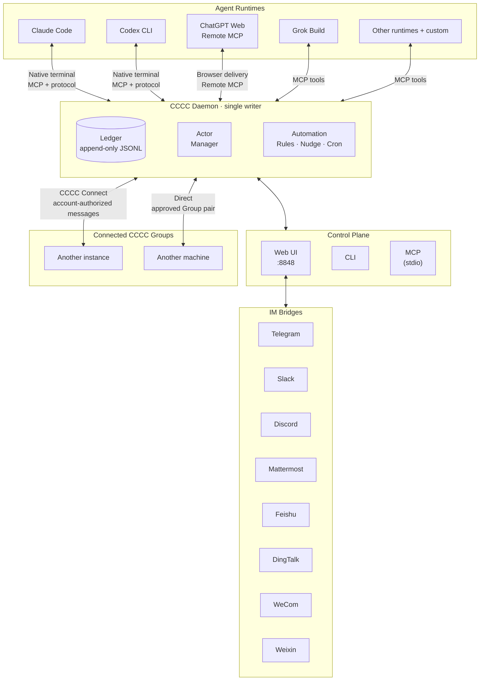

<div align="center">


# CCCC

### Coordinate your coding agents like a group chat

**Read receipts, delivery tracking, cross-instance collaboration, and mobile ops —
for Claude Code, Codex, ChatGPT Web, and other supported runtimes in one durable group.**

Run multiple coding agents as a **persistent, coordinated team** across runtimes, machines, and trusted working groups — not a pile of disconnected terminal sessions.

One install command. No Rust toolchain or infrastructure required.

[](https://pypi.org/project/cccc-pair/)
[](Cargo.toml)
[](LICENSE)
[](https://chesterra.github.io/cccc/)

**English** | [中文](README.zh-CN.md) | [日本語](README.ja.md)

</div>

---

<div align="center">

<a href="screenshots/overview.webp?raw=1" title="View desktop screenshot at full size"></a>
&nbsp;
<a href="screenshots/iphone.webp?raw=1" title="View mobile screenshot at full size"></a>

</div>

## Why CCCC

When several coding agents share work, you need to know who owns a task, whether a message reached its recipient, and what survives a restart. CCCC brings that coordination into one place, with Web and IM access when you are away from the terminal.

CCCC runs your agents as one durable, coordinated system:

- **Durable coordination** — message history lives in an append-only ledger; tasks and shared context have their own persistent stores.
- **Visible delivery semantics** — routing plus separate stored, runtime-delivery, read, and reply facts replace best-effort prompting.
- **One control plane** — Web UI, CLI, MCP, and IM bridges all operate on the same daemon-owned state.
- **Multi-runtime by default** — Claude Code, Codex CLI, ChatGPT Web, Grok Build, and other supported runtimes can collaborate in one group.
- **CCCC Connect across instances** — use same-account discovery, approved cross-member Group connections, or account-free Direct connections; each instance keeps its own state and access boundaries.
- **Local-first operations** — one install command, runtime state in `CCCC_HOME`, and remote supervision only when you choose to expose it.

## What CCCC Does

CCCC installs with one command and needs no separately operated database, message broker, or Docker:

| Capability | How |
|---|---|
| **Durable event history** | Append-only ledger (`ledger.jsonl`) records messages and collaboration events for replay and audit |
| **Reliable messaging** | Send / Send + Reply / Mail, separate delivery/read/reply facts, and a Mail-only Inbox consumed in ledger order — runtime handoff never pretends a message was read |
| **Unified control plane** | Web UI, CLI, MCP tools, and IM bridges all talk to one daemon — no state fragmentation |
| **Multi-runtime orchestration** | Mix supported coding-agent runtimes in one Group, with `custom` for other command-line agents |
| **CCCC Connect** | Connect your own instances, selected Groups across member accounts, or two Groups directly without an account |
| **Workspace tools** | Browse and edit files, inspect Git changes, pin documents in Presentation, and operate tiled native terminals |
| **Voice workflows** | Voice Secretary turns speech into documents or composer drafts; experimental Codex Voice pairs realtime conversation with a Runtime-backed Analyst |
| **Role-based coordination** | Foreman + peer model with permission boundaries and recipient routing (`@all`, `@peers`, `@foreman`) |
| **Local-first runtime state** | Runtime data stays in `CCCC_HOME`, not your repo, while Web Access and IM bridges cover remote operations |


## 0.4.40 Highlights

- **Three ways to connect:** same-account instances, selected Groups across members, and Direct Group connections without an account. Composer `#Group` references preserve the exact destination for Agents.
- **Files and Git in the workbench:** browse code and documents, edit text on desktop with draft/conflict protection, and inspect working-tree and staged changes.
- **Steadier reading and navigation:** compact Presentation slots, stable PDF previews, retained terminals across paging and Group switches, and clearer dark-mode surfaces and settings.
- **Native Mattermost support:** messages, files, threads and progressive replies through a dedicated Bot.
- **Runtime and configuration reliability:** Profile conversion and secret-save retries, Grok native MCP validation, interactive ChatGPT sign-in, and more useful Voice failure diagnostics.

The old manual Group Bridge is retired; its grants are not converted automatically. Historical messages remain readable. See the [0.4.40 release notes](docs/release/v0.4.40_release_notes.md) for upgrade behavior and the full changes.

## Quick Start

### Install

```bash
# macOS / Linux (recommended)
curl -fsSL https://chesterra.github.io/cccc/install.sh | sh

# Windows CMD or PowerShell (recommended)
powershell.exe -NoProfile -ExecutionPolicy Bypass -Command "[Net.ServicePointManager]::SecurityProtocol = [Net.ServicePointManager]::SecurityProtocol -bor [Net.SecurityProtocolType]::Tls12; Invoke-RestMethod 'https://chesterra.github.io/cccc/install.ps1' | Invoke-Expression"

# Native platform wheel (pip compatibility)
python -m pip install -U "cccc-pair>=0.4.36"
```

> **CCCC uses one native Rust implementation.** The website installer is
> recommended. The pip command installs the same native executable in a
> platform wheel for package-manager compatibility; it does not install a
> Python daemon, launcher, or fallback. Supported targets are Linux x86-64
> (glibc 2.28+), Apple Silicon macOS 11+, and Windows x86-64. CCCC v0.4.37
> is the final release for Intel Macs; newer releases do not publish
> `x86_64-apple-darwin` artifacts.

### Upgrade

```bash
# Website-installer ownership
cccc update

# pip ownership
python -m pip install -U "cccc-pair>=0.4.36"
```

Use `cccc update --check` to query the latest channel release and inspect the
installation owner and native platform requirements without changing the installation
or running services. It also works for pip-owned commands. Add `--offline` for
local details without a network request. A pip-owned command refuses standalone self-update
and prints the package-manager command instead. Both channels install the same
native product, but each remains owned by the installer that created it. Before
a pip upgrade, run `cccc daemon stop` and close any foreground CCCC process so
the package manager can replace the executable, especially on Windows. To
switch from pip to the website installer in the same command directory, first
run `python -m pip uninstall cccc-pair`; the standalone installer deliberately
refuses to overwrite pip-owned files, even with
`CCCC_ALLOW_REPLACE_EXISTING=1`.

If an older `cccc update` stays on `0.4.35`, use the version-constrained pip
command above in the Python environment that owns that installation.
`0.4.35` was the last portable Python release; an unsupported platform can
silently select it with an unconstrained pip upgrade. The minimum version makes
that mismatch an explicit error. See the [upgrade FAQ](https://chesterra.github.io/cccc/guide/faq#why-does-an-older-cccc-update-stay-on-0-4-35).

### Launch

```bash
cccc
```

Open **http://127.0.0.1:8848** — by default, CCCC brings up the daemon and the local Web UI together.
Direct `localhost` / `127.0.0.1` use stays passwordless and does not create an Access Token.
Explicit Admin Access Tokens are required only when enabling LAN, Remote Access, public URL, or
reverse-proxied access.

```bash
cccc status            # product, daemon, groups, actors, and agent runtimes
cccc doctor            # installation and environment diagnostics
cccc daemon status     # explicit daemon lifecycle status
```

`cccc python`, `cccc rust`, and the former `ccccd` alias are retired. Existing
automation should use `cccc daemon ...`; compatible daemon state filenames are
retained so 0.4.35 homes can be adopted without a Python runtime.

### Create a multi-agent group

Install and sign in to the agent CLIs you intend to use first. This example uses Claude Code and Codex CLI.

```bash
cd /path/to/your/repo
cccc attach .                              # bind this directory as a scope
cccc setup --runtime claude                # prepare only the runtimes used here
cccc setup --runtime codex
cccc actor add foreman --runtime claude    # first actor becomes foreman
cccc actor add implementer --runtime codex # add a peer
cccc group start                           # start all actors
cccc send "Please inspect the repo and propose the first safe task." --to foreman
cccc tracked-send "Please take the first concrete task and reply with validation evidence." \
  --to implementer \
  --title "First concrete task" \
  --outcome "The change and validation evidence are reported"
```

You now have two agents collaborating in a persistent group with full message history, delivery tracking, and a web dashboard. The daemon owns delivery and coordination, and runtime state stays in `CCCC_HOME` rather than inside your repo.

**What you should see:** in the Web UI at http://127.0.0.1:8848, both actors show as running, the foreman's reply arrives in **Messages**, and the tracked request displays its delivery and read state on the message. If an actor stays stopped, run `cccc doctor` to check the runtime, and see the [FAQ](https://chesterra.github.io/cccc/guide/faq) for common first-run fixes.

## Programmatic Access (SDK)

Use the official SDK when you need to integrate CCCC into external applications or services:

```bash
pip install -U cccc-sdk
npm install cccc-sdk
cargo add cccc-sdk
```

The SDK does not include a daemon. It connects to a running `cccc` core instance.

## Architecture



**Key design decisions:**

- **Daemon owns shared coordination** — Actor lifecycle, message delivery and collaboration mutations go through its control plane
- **Ledger is append-only** — new events record changes without rewriting past events; Group configuration and context have separate authoritative stores
- **Ports share that control plane** — Web, CLI, MCP and IM route collaboration through the daemon; Web also hosts browser, voice and IM integration services
- **Instance authority stays separate** — account/device bindings or approved Direct Group grants authorize cross-instance messages; each target independently authorizes its Web view
- **Runtime home is `CCCC_HOME`** (default `~/.cccc/`) — runtime state stays out of your repo

## Supported Runtimes

CCCC supports 18 built-in runtime integrations, plus `custom` for other command-line agents. Each actor in a Group can use a different runtime. Integration surfaces and setup requirements vary:

| Runtime | Integration | Entrypoint / Surface |
|---------|-------------|----------------------|
| Claude Code | Managed Agent View session + native TUI; per-session MCP | `claude` |
| Cline CLI | Auto MCP setup | `cline` |
| Codex CLI | Managed app-server session + native TUI; per-Actor MCP | `codex` |
| DeepSeek Harness | Managed ACP developer preview; no native terminal | CCCC-managed `dsh-acp-demo` |
| GitHub Copilot CLI | Auto MCP setup | `copilot` |
| Cursor CLI | Prompt-assisted MCP setup | `cursor-agent` |
| Devin CLI | Auto MCP setup | `devin` |
| Kiro CLI | Auto MCP setup | `kiro-cli` |
| Kilo Code CLI | Managed ACP session + native TUI; per-session MCP | `kilo` |
| Antigravity CLI | Auto MCP setup | `agy` |
| ChatGPT Web | Remote MCP + Browser Delivery | `chatgpt.com` conversation |
| Grok Build | Managed ACP session + native TUI; automatic native MCP setup | `grok` |
| Hermes Agent | Auto MCP setup | `hermes` |
| Droid | Auto MCP setup | `droid` |
| Amp | Auto MCP setup | `amp` |
| Auggie | Auto MCP setup | `auggie` |
| Kimi Code | Auto MCP setup | `kimi` |
| OpenCode | Managed ACP session + native TUI; per-session MCP | `opencode` |
| Custom | Manual | Any command |

These are stable runtime entrypoints or surfaces. CCCC applies runtime-specific launch defaults automatically; actor/profile commands can be reviewed and customized in settings. The [Supported Runtimes guide](https://chesterra.github.io/cccc/guide/runtimes) lists the default autonomy flags, including approval-bypass modes such as `agy --dangerously-skip-permissions`, `grok --always-approve`, and `opencode --auto`.

```bash
cccc setup --runtime claude       # reports CCCC-owned per-session MCP
cccc setup --runtime cline        # configures Cline CLI MCP for its native TUI
cccc setup --runtime cursor       # shows the prompt-assisted MCP setup contract
cccc setup --runtime kilo         # reports CCCC-owned per-session MCP
cccc setup --runtime antigravity  # configures Antigravity MCP before Actor startup
cccc runtime list --all           # show all available runtimes
cccc doctor                       # verify environment and runtime availability
```

Antigravity setup also disables native feedback surveys in its user settings, because the rating prompt can consume automated terminal input. Other preferences are preserved; this also applies to standalone AGY sessions under the same user.

Choose a Runtime; CCCC derives its interaction surface automatically. Claude Code, Codex CLI, Grok Build, OpenCode and Kilo pair a native writable terminal with a structured background protocol on the same provider session. Messages enter that terminal, leaving queue-versus-steer behavior to the receiving Runtime. DeepSeek Harness uses structured ACP without a native terminal; ChatGPT Web uses browser delivery and remote MCP.

For setup commands, interaction details, and troubleshooting for every supported Runtime, see the [Supported Runtimes guide](https://chesterra.github.io/cccc/guide/runtimes).

### ChatGPT Web as a local development actor

CCCC delivers Group messages into a bound ChatGPT conversation. A connector-capable ChatGPT session calls back through an Actor-bound remote MCP connector to receive messages, reply, inspect or edit repository files, and run scoped shell/git commands. The instance currently supports one Web Model Actor.

Setup requires exposing CCCC through a public HTTPS URL for the MCP connector (Cloudflare Tunnel, ngrok, Tailscale Funnel, or a reverse proxy). CCCC defaults to stable text-only delivery and also offers an experimental **GPT Pro** mode that attaches a tiny blank PNG when delivering each batch. This compatibility workaround does not switch ChatGPT models or guarantee connector availability, and may stop working when ChatGPT changes. Full setup and troubleshooting: [ChatGPT Web Model Runtime](https://chesterra.github.io/cccc/guide/web-model-runtime).

## CCCC Connect: across instances and teams

Choose the connection scope that fits your work:

| Method | Scope and setup |
|---|---|
| **Same account** | Link instances in **Settings → Account**. Their Groups and Actors can discover and message one another without manual Group pairing. |
| **Different members** | Open **Group connections** from the Group's sidebar **⋮** menu or Group settings. Invite a Member ID; both members confirm their own Group on the account website. |
| **Direct, no account** | Open **Group connections → Direct connection**. Exchange an invitation over a trusted channel and approve the exact Group pair. One instance must accept connections over a reachable LAN, VPN or existing network route. |

Every instance retains its own state and history. Cross-member and Direct connections grant messages, replies and small files between the selected Groups, not terminals, workspace browsing or arbitrary tools. Direct does not require a public Web interface or provide a network relay.

The sidebar can open same-account remote workspaces for administrators, using **each target instance's own admin Access Token** and a reachable HTTPS route. Restricted access stays within one instance. Browser authority is separate from background collaboration grants.

Agents discover qualified targets with `cccc_connect` and send through `cccc_message_send` or `cccc_file` using both `dst_instance_id` and `dst_group_id`. Replies use the received local Event ID. Selecting a remote **`#Group`** in the composer preserves that qualified identity for local Agents; it does not itself send remotely or grant access. See the [CCCC Connect guide](https://chesterra.github.io/cccc/guide/connect).

## Messaging & Coordination

CCCC implements IM-grade messaging semantics, not just "paste text into a terminal":

- **Recipient routing** — `@all`, `@peers`, `@foreman`, or specific actor IDs
- **Three explicit modes** — Send for active delivery, Send + Reply for a concrete response, and Mail for non-interrupting Inbox delivery
- **Separate facts** — `runtime.delivery`, Mail read cursors, replies, cancellations, and task completion never impersonate one another
- **Consuming Inbox reads** — `cccc_inbox_read` returns the next ordered Mail batch and advances its Mail cursor atomically
- **Reply & quote** — structured `reply_to` with quoted context
- **Reply requests** — Send + Reply is tracked until the recipient responds or the sender cancels it
- **Lifecycle boundaries** — paused, stopped, or disabled actors are not silently awakened by delivery
- **Qualified remote recipients** — Connect uses both instance and Group IDs, avoiding collisions with local Groups.

Use Mail for useful agent updates that can wait, Send when delayed awareness would cost more than interrupting the recipient, and Send + Reply only when a concrete answer is also required. Mail cannot target the human user. One message addresses either `user` alone or one/more agents—send separate messages instead of mixing those audiences. Use `tracked-send` when delegated work needs a durable owner, outcome, evidence, handoff, or acceptance trail. `@all` remains available for announcements or urgent shared coordination, but it should not be the default way to start concrete work.

Push attempts travel through the daemon-managed delivery pipeline. Their `runtime.delivery` facts remain separate from Inbox read state and replies.

## Automation & Policies

A small set of delivery timers and automation rules handles operational concerns without turning every message into a prompt:

| Policy | What it does |
|--------|-------------|
| **Mail notice** | Sends at most one content-free reminder after a configurable wait for concrete-recipient Mail |
| **Reply notice** | Sends at most one reminder for an accepted Send + Reply whose reply is still open |
| **Actor idle detection** | Notifies foreman when an agent goes silent |
| **Keepalive** | Periodic check-in reminders for the foreman |
| **Silence detection** | Alerts when an entire group goes quiet |

Beyond built-in policies, you can create custom automation rules:

- **Interval triggers** — "every N minutes, send a standup reminder"
- **Cron schedules** — "every weekday at 9am, post a status check"
- **One-time triggers** — "at 5pm today, pause the group"
- **Operational actions** — set group state or control actor lifecycles (admin-only, one-time only)

## Web UI

The built-in Web UI at `http://127.0.0.1:8848` provides:

- **Messages** — `@Actor` and `#Group` completion, replies, search and separate delivery/read/reply states
- **Tiled native terminals** — direct input, paging and retained recent views across Group switches
- **Files & Git** — workspace browsing, code/document/media previews, desktop editing and file management; Git changes are read-only
- **Presentation** — four compact pinned slots with expandable readers, zoom and quoting
- **Group & Actor management** — lifecycle controls, linked Runtime Profiles or Custom configuration, and private environment settings
- **Automation rule editor** — configure triggers, schedules, and actions visually
- **Project Context** — shared coordination, tasks, Agent state and self-evolving skills
- **Group Space** — NotebookLM integration for shared knowledge management
- **ChatGPT Web Model setup** — connect one ChatGPT Web conversation as a CCCC actor
- **Voice Secretary & Codex Voice** — speech-to-document/composer workflows and experimental realtime Voice with a retained Analyst
- **CCCC Connect settings** — account discovery, selected Group connections and Direct pairing
- **IM bridge configuration** — Telegram, Slack, Discord, Mattermost, Feishu, DingTalk, WeCom and Weixin
- **Settings** — messaging policies, delivery tuning, terminal transcript controls
- **Text scale** — 90% / 100% / 125% font size with per-browser persistence
- **Light / Dark / System themes**

### Remote access

Direct localhost use needs no Access Token. Before exposing Web to another machine, create an **Admin Access Token** in **Settings → Web Access**; remote access remains authenticated. Local first-time setup does not require a bootstrap code; first-time setup through a remote address requires host proof.

- **LAN / private network** — use the saved Web Access binding or an explicit override: `cccc --host 0.0.0.0 --port 8848`. On WSL2's default NAT network, LAN access also needs mirrored networking or a Windows forwarding/firewall rule.
- **Existing tunnel or reverse proxy** — expose Web through HTTPS, for example `cloudflared tunnel --url http://127.0.0.1:8848`. Protect forwarding headers at the proxy and follow the [Web access guide](https://chesterra.github.io/cccc/guide/web-ui#security).
- **Managed Remote Access (CLI: `reach`)** — link the instance in **Settings → Account**, then enable Remote Access in **Web Access**. Local account linking prepares administrator access while preserving existing credentials. The managed helper is currently available on Linux and macOS, not Windows; Windows can use an external tunnel or reverse proxy.

```bash
cccc login
cccc reach on
cccc reach status
cccc reach off
```

Changing the saved binding takes effect after **Apply now** restarts a CCCC-managed Web process, or after restarting your external supervisor. Explicit `--host` / `--port` overrides take precedence over saved settings, which take precedence over `CCCC_WEB_HOST` / `CCCC_WEB_PORT`.

Remote Access installs a pinned `cloudflared` helper under `CCCC_HOME`; it does not upload the repository or ledger. Direct Group connections are a separate daemon-to-daemon path and do not require exposing the management Web UI.

## IM Bridges

Bridge your working group to your team's IM platform:

```bash
cccc im set telegram --token-env TELEGRAM_BOT_TOKEN
cccc im start
```

| Platform | Status |
|----------|--------|
| Telegram | ✅ Supported |
| Slack | ✅ Supported |
| Discord | ✅ Supported |
| Mattermost | ✅ Supported |
| Feishu / Lark | ✅ Supported |
| DingTalk | ✅ Supported |
| WeCom / 企业微信 | ✅ Supported |
| Weixin / 微信 | ✅ Supported |

> Telegram, Slack, Discord, Mattermost, Feishu, DingTalk, and WeCom support progressive replies; overlong results fall back to lossless final-message chunks. Weixin delivers lossless final messages and currently supports direct bot chats only.

Use plain text or `/send @foreman <message>` for coordination, `/status` to inspect Group health, and `/pause` / `/resume` to pause or resume that chat's subscription. Mattermost commands use an `@botname` prefix, for example `@cccc_bot /status`; see the [Mattermost setup guide](https://chesterra.github.io/cccc/guide/im-bridge/mattermost).

## CLI Reference

```bash
# Lifecycle
cccc                           # start daemon + web UI
cccc daemon start|status|stop  # daemon management

# Groups
cccc attach .                  # bind current directory
cccc groups                    # list all groups
cccc use <group_id>            # switch active group
cccc group start|stop          # start/stop all actors

# Actors
cccc actor add <id> --runtime <runtime>
cccc actor start|stop|restart <id>

# Messaging
cccc send "message" --to foreman
cccc tracked-send "delegated work" --to implementer --title "Task title" --outcome "Done criterion"
cccc send "announcement" --to @all  # explicit broadcast
cccc reply <event_id> "response"
cccc tail -n 50 -f             # follow the ledger

# Inbox
cccc inbox --actor-id <id>     # read and consume the next unread Mail batch

# Operations
cccc doctor                    # environment check
cccc setup --runtime <name>    # configure MCP
cccc runtime list --all        # available runtimes

# IM
cccc im set <platform> --token-env <ENV_VAR>
cccc im start|stop|status
```

## MCP Tools

Ordinary Actors always see a compact collaboration core, including `cccc_connect`. Other built-in tools remain callable through `cccc_capability_use` without exposing their full packs in every session. Web Model connectors and specialized assistants have role-specific tool surfaces.

| Surface | Examples |
|---------|----------|
| **Always-visible protocol core** | `cccc_bootstrap`, `cccc_help`, capability search/use, inbox, messaging, files, `cccc_context_get`, `cccc_coordination`, `cccc_task`, `cccc_agent_state` |
| **Project context & memory (on demand)** | `cccc_project_info`, `cccc_tracked_send`, `cccc_memory`, `cccc_context_sync` |
| **Group & actor control (on demand)** | `cccc_group`, `cccc_actor`, `cccc_runtime_list` |
| **Workspace utilities (on demand)** | `cccc_repo`, `cccc_presentation`, `cccc_terminal`, `cccc_debug` |
| **Instance discovery** | `cccc_connect`; qualified targets in `cccc_message_send` and `cccc_file` |
| **Other capability-backed tools** | `cccc_automation`, `cccc_space`, capability administration, `cccc_im_bind` |

The reduced core preserves the collaboration protocol while leaving workflow, reasoning style, and optional machinery to the agent and current task.
`cccc_help` remains the on-demand reference for CCCC-specific state, recovery, delegation, and capability routes; it does not prescribe a general reasoning or writing method.

## Where CCCC Fits

| Scenario | Fit |
|----------|-----|
| Multiple coding agents collaborating on one codebase | ✅ Core use case |
| Human + agent coordination with full audit trail | ✅ Core use case |
| Long-running groups managed remotely via phone/IM | ✅ Strong fit |
| Multi-runtime teams (e.g., Claude + Codex + Kimi) | ✅ Strong fit |
| Groups collaborating across machines or teams | ✅ Strong fit |
| Single-agent local coding helper | ⚠️ Works, but CCCC's value shines with multiple participants |
| Pure DAG workflow orchestration | ❌ Use a dedicated orchestrator; CCCC can complement it |

CCCC is a **collaboration kernel** — it owns the coordination layer and stays composable with external CI/CD, orchestrators, and deployment tools.

## How CCCC Compares

| If you already use | It is great at | What CCCC adds |
|---|---|---|
| **Native agent teams** (e.g. Claude Code subagents/teams) | The smoothest single-vendor teamwork inside one session | Cross-vendor groups (Claude + Codex + Grok + Kimi…), state that survives restarts, phone/IM operations, and a full audit ledger |
| **Parallel task runners** (worktree/task-board tools) | Isolated, parallel task execution | A coordination layer: agents that talk, hand off, choose interruption levels, and get bounded reminders — plus 24/7 daemon-owned operations |
| **IM assistant gateways** | A personal assistant living in your chat app | Delivery-grade work semantics: tracked tasks, delivery/read/reply facts, multi-agent groups, and a durable audit trail |

CCCC does not replace your agents — it is the layer that makes them a team. Longer discussion: [FAQ — How does CCCC compare?](https://chesterra.github.io/cccc/guide/faq#how-does-cccc-compare-to-native-agent-teams-and-other-tools)

## Security

- **Web UI is high-privilege.** Create an Admin Access Token before non-local exposure. Public access requires HTTPS through a trusted tunnel or reverse proxy.
- **Daemon IPC is a trusted local interface without application authentication.** It uses a Unix socket where available or loopback TCP; do not expose it publicly or share the runtime home with untrusted users.
- **IM credentials** may be configured as environment-variable references or literal values. Prefer references when sharing configuration; do not publish credentials or runtime state.
- **Runtime state** lives in `CCCC_HOME` (`~/.cccc/`), separate from the repository.
- **Connection scope is explicit.** Same-account binding enables background collaboration among those instances; cross-member and Direct grants apply to selected Group pairs. Remote workbench access still requires each target's administrator Token.
- **Capability allowlists** control optional MCP surfaces. They are not a sandbox for native agent processes; review the Runtime's own permissions and autonomy defaults.

For security reporting, see [SECURITY.md](SECURITY.md); for operational access controls, see the [Web UI guide](https://chesterra.github.io/cccc/guide/web-ui).

## Documentation

📚 **[Full documentation](https://chesterra.github.io/cccc/)**

| Section | Description |
|---------|-------------|
| [Getting Started](https://chesterra.github.io/cccc/guide/getting-started/) | Install, launch, create your first group |
| [Use Cases](https://chesterra.github.io/cccc/guide/use-cases) | Practical multi-agent scenarios |
| [Web UI Guide](https://chesterra.github.io/cccc/guide/web-ui) | Navigating the dashboard |
| [CCCC Connect](https://chesterra.github.io/cccc/guide/connect) | Account and Direct connections, delivery and permissions |
| [Voice Secretary](https://chesterra.github.io/cccc/guide/voice-secretary) | Dictation, documents and composer workflows |
| [IM Bridge Setup](https://chesterra.github.io/cccc/guide/im-bridge/) | Connect Telegram, Slack, Discord, Mattermost, Feishu, DingTalk, WeCom, Weixin |
| [Group Space](https://chesterra.github.io/cccc/guide/group-space-notebooklm) | NotebookLM knowledge integration |
| [ChatGPT Web Model Runtime](https://chesterra.github.io/cccc/guide/web-model-runtime) | Connect MCP-capable ChatGPT Web as a CCCC actor, with an optional experimental GPT Pro delivery mode |
| [Capability Allowlist](https://chesterra.github.io/cccc/guide/capability-allowlist) | MCP capability governance |
| [Best Practices](https://chesterra.github.io/cccc/guide/best-practices) | Recommended patterns and workflows |
| [FAQ](https://chesterra.github.io/cccc/guide/faq) | Frequently asked questions |
| [Operations Runbook](https://chesterra.github.io/cccc/guide/operations) | Recovery, troubleshooting, maintenance |
| [CLI Reference](https://chesterra.github.io/cccc/reference/cli) | Complete command reference |
| [SDK (Python/TypeScript/Rust)](https://github.com/ChesterRa/cccc-sdk) | Integrate apps/services with official daemon clients |
| [Architecture](https://chesterra.github.io/cccc/reference/architecture) | Design decisions and system model |
| [Features Deep Dive](https://chesterra.github.io/cccc/reference/features) | Messaging, automation, runtimes in detail |
| [CCCS Standard](docs/standards/CCCS_V1.md) | Collaboration protocol specification |
| [Daemon IPC Standard](docs/standards/CCCC_DAEMON_IPC_V1.md) | IPC protocol specification |

## Installation Options

### Website installer (recommended)

```bash
# macOS / Linux
curl -fsSL https://chesterra.github.io/cccc/install.sh | sh

# Windows CMD or PowerShell
powershell.exe -NoProfile -ExecutionPolicy Bypass -Command "[Net.ServicePointManager]::SecurityProtocol = [Net.ServicePointManager]::SecurityProtocol -bor [Net.SecurityProtocolType]::Tls12; Invoke-RestMethod 'https://chesterra.github.io/cccc/install.ps1' | Invoke-Expression"
```

This installs the checksum-verified native product from GitHub Releases and
updates through the same installer. It targets glibc 2.28+ Linux x86-64 without
a system OpenSSL dependency, Apple Silicon macOS 11+, and Windows x86-64. The
installer refuses to overwrite an existing `cccc` command that it does not own;
uninstall that command deliberately or choose another `CCCC_INSTALL_DIR` first.
Commands in other directories are left untouched. For the default install
directory, the installer places the new command first in the user PATH and lists
any remaining duplicates. Open a new terminal and run `cccc doctor`; its
`Installation` section reports the invoked executable, the command selected by
PATH, and every conflicting command.

The installer selects the current published stable release unless an explicit
`CCCC_VERSION` is requested.

### pip compatibility (v0.4.36+)

```bash
python -m pip install -U "cccc-pair>=0.4.36"
```

Pip installs a 0.4.36-or-newer platform wheel containing the same `cccc`
executable. The lower bound prevents pip from silently selecting a historical
Python-only wheel when 0.4.36 has no wheel for the current platform. There is no
0.4.36 sdist, universal wheel, importable CCCC Python package, or fallback
implementation; unsupported platforms therefore fail resolution. Generic
`pip install .` and `pip install -e .` source builds are also rejected instead
of installing an empty package; use the source build commands below.

Cargo installation is retained for workspace development, not as a supported
end-user distribution.

### From source

Source packaging requires Rust 1.88+, Node.js 24 with npm, and Python 3.11+
for the archive helper only. Python is not part of the built CCCC product.

```bash
git clone https://github.com/ChesterRa/cccc
cd cccc
./scripts/build_package.sh
./target/release/cccc --version
./target/release/cccc
```

For an iterative debug build, use
`cargo run --locked --features standalone -p cccc --bin cccc -- --port 0`.
On Windows, run
`powershell.exe -NoProfile -ExecutionPolicy Bypass -File .\scripts\build_package.ps1`
and then `.\target\release\cccc.exe`.

### Native Windows Notes

- `scripts/build_package.ps1` installs the locked Web dependencies, embeds the
  Web bundle, compiles the native executable, and creates the archive.
- Use the `x86_64-pc-windows-msvc` Rust toolchain and run the newly built
  `cccc.exe doctor` after building.
- `scripts/build_web.ps1` is available as a convenience wrapper for the Web build.

### Docker

```bash
cd docker
docker compose up -d  # then create an Admin Access Token in Settings > Web Access before exposing beyond localhost
```

The Docker image bundles Claude Code, Codex CLI, and Factory CLI. See [`docker/`](docker/) for full configuration.

### Upgrading from 0.3.x

The tmux-first 0.3.x line is archived at [cccc-tmux](https://github.com/ChesterRa/cccc-tmux). The 0.4.x line uses a different architecture. Identify the old installation's owner, uninstall it through that package manager, then follow the installation steps above and run `cccc doctor`. Preserve your existing data; reinstalling the executable does not convert 0.3.x sessions into 0.4.x Groups.

## Community

📱 Join our Telegram group: [t.me/ccccpair](https://t.me/ccccpair)

Share workflows, troubleshoot issues, and connect with other CCCC users.

## Contributing

Contributions are welcome. Please:

1. Check existing [Issues](https://github.com/ChesterRa/cccc/issues) before opening a new one
2. For bugs: include `cccc --version`, OS, exact commands, and reproduction steps
3. For features: describe the problem, proposed behavior, and operational impact
4. Keep runtime state in `CCCC_HOME` — never commit it to the repo

## License

[Apache-2.0](LICENSE)
