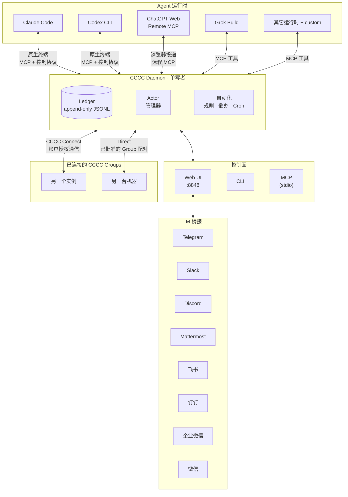

<div align="center">


# CCCC

### 像群聊一样指挥你的编码智能体

**已读回执、送达追踪、跨实例协作、手机远程运维 ——
Claude Code、Codex、ChatGPT Web 等受支持的运行时，在同一个持久协作组里。**

让多个 coding agent 跨运行时、跨机器、跨可信协作组作为一支**持久化、可协调的团队**运行 — 而不是一堆各自为政的终端窗口。

一条安装命令，无需 Rust 工具链或额外基础设施。

[](https://pypi.org/project/cccc-pair/)
[](Cargo.toml)
[](LICENSE)
[](https://chesterra.github.io/cccc/)

[English](README.md) | **中文** | [日本語](README.ja.md)

</div>

---

<div align="center">

<a href="screenshots/overview.webp?raw=1" title="查看桌面端大图"></a>
&nbsp;
<a href="screenshots/iphone.webp?raw=1" title="查看移动端大图"></a>

</div>

## 为什么选择 CCCC

多个编码智能体共同工作时，你需要知道任务由谁负责、消息是否送达，以及重启后哪些进展仍然保留。CCCC 将这些协作信息集中管理，也支持离开终端后通过 Web 和 IM 查看与操作。

CCCC 让你的 agent 作为一套持久、可协调的系统运行：

- **协作可持久** — 消息历史进入 append-only ledger；任务和共享上下文分别持久化保存。
- **触达事实可见** — 路由、存储、runtime 投递、已读和回复各自记录，不再把“已发送”当作“已看到”。
- **控制面统一** — Web UI、CLI、MCP、IM 桥接全部围绕同一 daemon 运作，不会出现多套状态。
- **多运行时是默认能力** — Claude Code、Codex CLI、ChatGPT Web、Grok Build 以及其它受支持的运行时可以在同一协作组内协同工作。
- **CCCC Connect 跨实例协作** — 支持同账户发现、经批准的跨会员 Group 连接，以及免账号的 Direct 连接；各实例保持自己的状态和权限边界。
- **本地优先但可远程值守** — 单条安装命令即可启动，运行时状态放在 `CCCC_HOME`，需要时再通过 Web / IM 远程运维。

## CCCC 能做什么

CCCC 只需一条安装命令，无需单独运维数据库、消息队列或 Docker：

| 能力 | 实现方式 |
|---|---|
| **持久事件历史** | append-only ledger（`ledger.jsonl`）记录消息与协作事件，支持回放和审计 |
| **可靠的消息语义** | Send / Send + Reply / Mail 三种模式，投递、已读、回复事实分离；只含 Mail 的 Inbox 按 ledger 顺序消费 — runtime 接收不冒充已读 |
| **统一控制面** | Web UI、CLI、MCP 工具、IM 桥接全部对接同一 daemon — 不存在状态分裂 |
| **多运行时编排** | 同一 Group 可混用受支持的编码智能体运行时；其它命令行智能体可使用 `custom` |
| **CCCC Connect** | 连接自己的实例、不同会员的指定 Group，或免账号直连两个 Group |
| **工作区工具** | 浏览和编辑文件、查看 Git 变更、在 Presentation 固定文档，并操作平铺原生终端 |
| **语音工作流** | Voice Secretary 将语音整理为文档或输入框草稿；实验性 Codex Voice 将实时对话与 Runtime 驱动的 Analyst 配合使用 |
| **角色化协调** | Foreman + Peer 角色模型，权限边界清晰，收件人路由精确（`@all`、`@peers`、`@foreman`） |
| **本地优先的运行时状态** | 运行时数据保存在 `CCCC_HOME` 而不是代码仓库里，同时仍可通过 Web Access 与 IM 做远程运维 |

## 0.4.40 要点

- **三种连接方式**：同账户实例、跨会员的指定 Group，以及免账号的 Direct Group 连接。输入框的 `#Group` 引用为 Agent 保留准确的目标身份。
- **Files 与 Git 工作区工具**：浏览代码和文档，桌面文本编辑支持草稿保护与冲突检测，并可查看工作区及暂存区变更。
- **更稳定的阅读和导航**：紧凑的 Presentation 槽位、不再随轮询闪烁的 PDF、翻页和切组时保留的终端，以及更清晰的深色界面和设置。
- **原生 Mattermost 接入**：通过专用 Bot 支持消息、文件、话题串和渐进式回复。
- **运行时与配置可靠性**：完善 Profile 转换和私密配置保存重试、Grok 原生 MCP 校验、ChatGPT 交互式登录和 Voice 故障诊断。

旧手工 Group Bridge 已退役，原有授权不会自动转换；历史消息仍可阅读。升级行为与完整变更见 [0.4.40 发布说明](docs/release/v0.4.40_release_notes.md)。

## 快速上手

### 安装

```bash
# macOS / Linux（推荐）
curl -fsSL https://chesterra.github.io/cccc/install.sh | sh

# Windows CMD 或 PowerShell（推荐）
powershell.exe -NoProfile -ExecutionPolicy Bypass -Command "[Net.ServicePointManager]::SecurityProtocol = [Net.ServicePointManager]::SecurityProtocol -bor [Net.SecurityProtocolType]::Tls12; Invoke-RestMethod 'https://chesterra.github.io/cccc/install.ps1' | Invoke-Expression"

# 兼容 pip 的原生平台 wheel
python -m pip install -U "cccc-pair>=0.4.36"
```

> **CCCC 使用统一的原生 Rust 实现。** 推荐使用官网安装脚本；pip 命令用于
> 包管理器兼容，安装的是同一个原生可执行文件，不包含 Python daemon、启动器或
> 回退实现。支持 Linux x86-64（glibc 2.28+）、Apple Silicon macOS 11+ 和
> Windows x86-64。CCCC v0.4.37 是最后一个支持 Intel Mac 的版本；后续版本不再
> 发布 `x86_64-apple-darwin` 构件。

### 升级

```bash
# 官网安装脚本所有的安装
cccc update

# 由 pip 管理的安装
python -m pip install -U "cccc-pair>=0.4.36"
```

运行 `cccc update --check` 可查询渠道最新版本，查看安装所有者及原生平台要求，
不会更改安装或运行中的服务；pip 安装也可以检查。加上 `--offline` 只查看本机信息，
不发出网络请求。由 pip 管理的命令仍会
明确拒绝 standalone 自更新并提示包管理器命令。两条渠道安装的是同一个原生产品，
但文件始终由最初创建它们的安装器管理。使用 pip 升级前请运行
`cccc daemon stop` 并关闭前台 CCCC 进程，确保包管理器可以替换可执行文件，
Windows 尤其如此。如果要在同一命令目录从 pip 切换到官网安装脚本，请先运行
`python -m pip uninstall cccc-pair`；即使设置了
`CCCC_ALLOW_REPLACE_EXISTING=1`，官网安装器也不会覆盖 pip 管理的文件。

若旧版 `cccc update` 始终停在 `0.4.35`，请在安装它的 Python 环境中执行上面带最低
版本约束的 pip 命令。`0.4.35` 是最后提供通用 Python 包的版本；不受支持的平台执行
无版本约束的 pip 升级时，可能仍然选中它。最低版本约束会让不匹配明确报错，详见
[升级 FAQ](https://chesterra.github.io/cccc/guide/faq#why-does-an-older-cccc-update-stay-on-0-4-35)。

### 启动

```bash
cccc
```

打开 **http://127.0.0.1:8848** — 默认会一起拉起 daemon 和本地 Web UI。
直接通过 `localhost` / `127.0.0.1` 使用时保持免密，也不会自动创建 Access Token。
只有开启 LAN、Remote Access、公网 URL 或反向代理访问时才需要显式管理员 Token。

```bash
cccc status            # 查看产品、daemon、group、actor 和 agent runtime
cccc doctor            # 检查安装与运行环境
cccc daemon status     # 显式查看 daemon 生命周期状态
```

`cccc python`、`cccc rust` 和原来的 `ccccd` 别名均已退役。已有自动化应改用
`cccc daemon ...`；daemon 状态文件名保持兼容，因此可以在没有 Python runtime
的情况下直接接管 0.4.35 的 home。

### 建立多智能体协作组

请先安装并登录要使用的智能体 CLI；以下示例使用 Claude Code 和 Codex CLI。

```bash
cd /path/to/your/repo
cccc attach .                              # 绑定当前目录为 scope
cccc setup --runtime claude                # 仅准备本例使用的运行时
cccc setup --runtime codex
cccc actor add foreman --runtime claude    # 第一个 actor 自动成为 foreman
cccc actor add implementer --runtime codex # 添加 peer
cccc group start                           # 启动所有 actor
cccc send "请检查这个仓库，并提出第一个安全任务。" --to foreman
cccc tracked-send "请接手第一个具体任务，并回复验证证据。" \
  --to implementer \
  --title "第一个具体任务" \
  --outcome "已报告变更和验证证据"
```

此刻你已拥有两个 agent 在一个持久化协作组中协同工作，具备完整的消息历史、触达追踪和 Web 看板。投递与协调由 daemon 统一负责，运行时状态则保存在 `CCCC_HOME`，不会污染代码仓库。

**此刻你应该看到：**在 http://127.0.0.1:8848 的 Web UI 中，两个 actor 都处于运行状态，foreman 的回复出现在**聊天**里，tracked 请求的消息上显示着送达与已读状态。如果有 actor 一直没起来，先运行 `cccc doctor` 检查运行时，常见首跑问题见 [FAQ](https://chesterra.github.io/cccc/guide/faq)。

## 程序化接入（SDK）

如果你要从外部应用或服务编程接入 CCCC，请使用官方 SDK：

```bash
pip install -U cccc-sdk
npm install cccc-sdk
cargo add cccc-sdk
```

SDK 不包含 daemon，需要连接已运行的 `cccc` 本体实例。

## 架构



**关键设计决策：**

- **Daemon 管理共享协作状态** — Actor 生命周期、消息投递和协作状态变更经由同一控制面处理
- **Ledger append-only** — 通过新增事件记录变化，不改写过去的事件；Group 配置与上下文各自有独立的权威存储
- **入口共享控制面** — Web、CLI、MCP 和 IM 经由 daemon 完成协作操作；Web 还承载浏览器、语音和 IM 集成服务
- **实例权限独立** — 账户与设备绑定或经批准的 Direct Group 授权允许跨实例通信；每个目标独立验证网页访问权限
- **运行时目录 `CCCC_HOME`**（默认 `~/.cccc/`）— 运行时状态与代码仓库严格分离

## 支持的运行时

CCCC 内置 18 种运行时接入，另支持通过 `custom` 启动其它命令行智能体。同一 Group 的 Actor 可使用不同运行时，其交互方式与配置要求也有所区别：

| 运行时 | 接入方式 | 入口 |
|---------|----------|-------------|
| Claude Code | 托管 Agent View 会话 + 原生 TUI；按会话注入 MCP | `claude` |
| Cline CLI | 自动 MCP 配置 | `cline` |
| Codex CLI | 托管 app-server 会话 + 原生 TUI；按 Actor 配置 MCP | `codex` |
| DeepSeek Harness | 托管 ACP 开发者预览；无原生终端 | CCCC 托管的 `dsh-acp-demo` |
| GitHub Copilot CLI | 自动 MCP 配置 | `copilot` |
| Cursor CLI | 提示词辅助 MCP 配置 | `cursor-agent` |
| Devin CLI | 自动 MCP 配置 | `devin` |
| Kiro CLI | 自动 MCP 配置 | `kiro-cli` |
| Kilo Code CLI | 托管 ACP 会话 + 原生 TUI；按会话注入 MCP | `kilo` |
| Antigravity CLI | 自动 MCP 配置 | `agy` |
| ChatGPT Web | 远程 MCP + 浏览器投递 | `chatgpt.com` 对话 |
| Grok Build | 托管 ACP 会话 + 原生 TUI；自动配置原生 MCP | `grok` |
| Hermes Agent | 自动 MCP 配置 | `hermes` |
| Droid | 自动 MCP 配置 | `droid` |
| Amp | 自动 MCP 配置 | `amp` |
| Auggie | 自动 MCP 配置 | `auggie` |
| Kimi Code | 自动 MCP 配置 | `kimi` |
| OpenCode | 托管 ACP 会话 + 原生 TUI；按会话注入 MCP | `opencode` |
| Custom | 手动配置 | 任意命令 |

表中列出了运行时命令或浏览器入口。CCCC 会自动套用各运行时的启动默认设置；Actor / Profile 的命令可在设置中查看和自定义。[支持的运行时指南](https://chesterra.github.io/cccc/guide/runtimes)列出了默认自主执行参数，包括 `agy --dangerously-skip-permissions`、`grok --always-approve`、`opencode --auto` 等跳过审批模式。

```bash
cccc setup --runtime claude       # 确认由 CCCC 按会话注入 MCP
cccc setup --runtime cline        # 为 Cline 原生 TUI 自动配置 MCP
cccc setup --runtime cursor       # 显示提示词辅助 MCP 配置协议
cccc setup --runtime kilo         # 确认由 CCCC 按会话注入 MCP
cccc setup --runtime antigravity  # 在 Actor 启动前自动配置 Antigravity MCP
cccc runtime list --all           # 列出所有可用运行时
cccc doctor                       # 检查环境和运行时可用性
```

Antigravity 配置还会在其用户设置中关闭原生评分问卷，避免问卷消耗自动投递的终端输入。其它偏好保持不变；同一用户独立运行的 AGY 也会关闭问卷。

用户只需选择 Runtime，CCCC 会自动确定交互方式。Claude Code、Codex CLI、Grok Build、OpenCode 和 Kilo 在同一个 provider session 上配对原生可写终端与后台结构化协议。消息进入原生终端后，由接收 Runtime 决定是 steer 还是 queue。DeepSeek Harness 使用结构化 ACP，不提供原生终端；ChatGPT Web 使用浏览器投递和远程 MCP。

每个支持 Runtime 的 setup 命令、交互说明和排障方式，见[支持的运行时指南](https://chesterra.github.io/cccc/guide/runtimes)。

### ChatGPT Web 作为本地开发 actor

CCCC 通过浏览器投递把 Group 消息送入绑定的 ChatGPT 对话。支持 connector 的 ChatGPT 会话经由 Actor 绑定的远程 MCP 接收消息、回复、查看或编辑仓库文件，以及运行受 scope 限制的 shell/git 命令。当前每个实例支持一个 Web Model Actor。

配置需要通过公网 HTTPS URL 暴露 MCP connector（Cloudflare Tunnel、ngrok、Tailscale Funnel 或反向代理）。CCCC 默认使用稳定的纯文本投递，也提供实验性的 **GPT Pro** 模式：每次投递会附带一张极小的空白 PNG，以兼容部分账户中由此开放第三方 MCP 的 ChatGPT 行为。CCCC 不会替你切换模型，也不保证该兼容方式在 ChatGPT 改版后继续有效。完整配置与排障见 [ChatGPT Web Model Runtime](https://chesterra.github.io/cccc/guide/web-model-runtime)。

## CCCC Connect：跨实例与团队协作

按工作需要选择连接范围：

| 方式 | 范围与设置 |
|---|---|
| **同一账户** | 在 **设置 → 账户** 关联各实例；其 Group 和 Actor 无需逐组配对即可相互发现和通信。 |
| **不同会员** | 从侧边栏 Group 的 **⋮ → Group 连接** 或 Group 设置进入，邀请对方 Member ID；双方在账户网站确认自己的 Group。 |
| **Direct，免账号** | 进入 **Group 连接 → 直接连接**，通过可信渠道交换邀请，再批准准确的 Group 配对。一端需要通过可达的局域网、VPN 或现有网络路由接收连接。 |

各实例保留自己的状态与历史。跨会员及 Direct 连接只允许指定 Group 间的消息、回复和小文件通信，不开放终端、工作区浏览或任意工具。Direct 不要求公开 Web 管理界面，也不提供网络中继。

管理员可以在侧边栏打开同账户远端工作区，但需使用**各目标实例自己的管理员 Access Token** 和可达的 HTTPS 地址。受限访问保持单实例；网页权限与后台协作授权彼此独立。

Agent 使用 `cccc_connect` 发现目标，再通过 `cccc_message_send` 或 `cccc_file` 同时指定 `dst_instance_id` 与 `dst_group_id`；回复使用收到的本地 Event ID。在输入框中选择远端 **`#Group`** 会为本地 Agent 保留这一准确身份，本身不会远程发信或授予权限。详见 [CCCC Connect 指南](https://chesterra.github.io/cccc/guide/connect)。

## 消息与协调

CCCC 实现的是 IM 级消息语义，而不是"往终端里粘贴一段文字"：

- **收件人路由** — `@all`、`@peers`、`@foreman`，或指定 actor ID
- **三种明确模式** — Send 主动投递，Send + Reply 要求具体回复，Mail 只进入 Inbox 而不立即打断
- **事实彼此分离** — `runtime.delivery`、Mail 已读游标、回复、取消和任务完成互不冒充
- **消费式 Inbox 读取** — `cccc_inbox_read` 按顺序返回下一批 Mail，并原子推进 Mail 游标
- **回复与引用** — 结构化的 `reply_to` + 引用上下文
- **回复请求** — Send + Reply 持续追踪到收件人回复或发送方取消
- **生命周期边界** — paused、stopped 或 disabled actor 不会被消息投递静默唤醒
- **明确远端身份** — Connect 同时使用 instance 和 Group ID，避免与本地同名 ID 混淆。

有用但可以延后查看的 agent 信息使用 Mail；延迟知晓的代价高于打断时使用 Send；还必须得到具体回答时才使用 Send + Reply。Mail 不能发给人类用户。单条消息只能发给 `user`，或发给一个/多个 agent，不能混合两类受众；需要同时通知时应拆成两条消息。需要明确负责人、完成标准、证据、交接或验收轨迹的委派工作，应使用 `tracked-send`。`@all` 仍可用于公告或紧急共享约束，但不应作为具体任务分派的默认方式。

主动投递通过 daemon 管理的链路执行，其 `runtime.delivery` 事实与 Inbox 已读状态和回复始终分开。

## 自动化与策略

少量投递计时器与自动化规则处理运维关切，同时避免把每条消息都变成 prompt：

| 策略 | 功能 |
|------|------|
| **Mail 提醒** | 明确收件人的 Mail 等待到配置期限后，最多发送一次不含正文的提醒 |
| **回复提醒** | 已投递的 Send + Reply 尚未回复时，最多发送一次提醒 |
| **Actor 空闲检测** | agent 沉默时通知 foreman |
| **Keepalive** | 周期性向 foreman 发送签到提醒 |
| **静默检测** | 整个协作组无活动时告警 |

除内置策略外，还可创建自定义自动化规则：

- **间隔触发** — "每 N 分钟发送一次站会提醒"
- **Cron 排程** — "工作日每天 9 点发布状态检查"
- **一次性触发** — "今天下午 5 点暂停协作组"
- **运维动作** — 设置组状态或控制 actor 生命周期（仅管理员，仅一次性）

## Web UI

内置 Web UI `http://127.0.0.1:8848` 提供：

- **消息** — `@Actor` 与 `#Group` 补全、回复、搜索，以及独立的投递／已读／回复状态
- **平铺原生终端** — 直接输入、翻页，切换 Group 时保留近期视图
- **Files 与 Git** — 工作区浏览、代码／文档／媒体预览、桌面端编辑和文件管理；Git 变更只读查看
- **Presentation** — 四个紧凑的固定槽位，支持展开阅读、缩放和引用
- **Group 与 Actor 管理** — 生命周期控制、关联 Runtime Profile 或自定义配置，以及私密环境变量
- **自动化规则编辑器** — 可视化配置触发器、排程和动作
- **Project Context** — 共享协调、任务、Agent 状态与自演化技能
- **Group Space** — NotebookLM 集成，共享知识管理
- **ChatGPT Web Model 设置** — 将一个 ChatGPT Web 对话接入为 CCCC Actor
- **Voice Secretary 与 Codex Voice** — 语音转文档／输入框草稿，以及带持久 Analyst 的实验性实时语音
- **CCCC Connect 设置** — 账户发现、指定 Group 连接与 Direct 配对
- **IM 桥接配置** — Telegram、Slack、Discord、Mattermost、飞书、钉钉、企业微信和微信
- **设置** — 消息策略、投递调优、终端日志控制
- **文本缩放** — 90% / 100% / 125% 三级字体大小，按浏览器保存
- **亮色／暗色／跟随系统主题**

### 远程访问

直接从 localhost 使用无需 Access Token。将 Web 开放给其它机器前，请在 **设置 → Web Access** 创建**管理员 Access Token**；远程访问仍需认证。本机首次设置无需引导码；通过远程地址首次设置时，需要证明对主机的控制权。

- **局域网／内网** — 使用 Web Access 保存的绑定，或显式覆盖：`cccc --host 0.0.0.0 --port 8848`。WSL2 默认 NAT 网络还需要镜像网络或 Windows 转发／防火墙规则，才能供局域网访问。
- **已有隧道或反向代理** — 通过 HTTPS 暴露 Web，例如 `cloudflared tunnel --url http://127.0.0.1:8848`。在代理端保护转发头，具体配置见 [Web 访问指南](https://chesterra.github.io/cccc/guide/web-ui#security)。
- **托管 Remote Access（CLI：`reach`）** — 在 **设置 → 账户** 关联实例，然后在 **Web Access** 开启 Remote Access。本机关联账户会准备管理员访问，同时保留已有凭据。托管辅助程序目前支持 Linux 和 macOS，不支持 Windows；Windows 可使用外部隧道或反向代理。

```bash
cccc login
cccc reach on
cccc reach status
cccc reach off
```

修改已保存的绑定后，可用 **Apply now** 重启由 CCCC 管理的 Web，或重启自己的外部主管服务。显式 `--host`／`--port` 优先于已保存的设置，后者又优先于 `CCCC_WEB_HOST`／`CCCC_WEB_PORT`。

Remote Access 将固定版本的 `cloudflared` 放在 `CCCC_HOME`，不会上传仓库或 ledger。Direct Group 连接是独立的 daemon 间通信方式，不要求开放 Web 管理界面。

## IM 桥接

将协作组桥接到团队 IM 平台：

```bash
cccc im set telegram --token-env TELEGRAM_BOT_TOKEN
cccc im start
```

| 平台 | 状态 |
|------|------|
| Telegram | ✅ 已支持 |
| Slack | ✅ 已支持 |
| Discord | ✅ 已支持 |
| Mattermost | ✅ 已支持 |
| 飞书 / Lark | ✅ 已支持 |
| 钉钉 | ✅ 已支持 |
| 企业微信 / WeCom | ✅ 已支持 |
| 微信 / Weixin | ✅ 已支持 |

> Telegram、Slack、Discord、Mattermost、飞书、钉钉和企业微信均支持渐进式回复；超长结果会回退为无损分段的最终消息。微信采用无损最终消息投递，目前仅支持机器人私聊。

使用普通文本或 `/send @foreman <消息>` 协作，`/status` 查看 Group 状态，`/pause`／`/resume` 暂停或恢复当前聊天的订阅。Mattermost 命令需要 `@botname` 前缀，例如 `@cccc_bot /status`；详见 [Mattermost 配置指南](https://chesterra.github.io/cccc/guide/im-bridge/mattermost)。

## CLI 速查

```bash
# 生命周期
cccc                           # 启动 daemon + Web UI
cccc daemon start|status|stop  # daemon 管理

# 协作组
cccc attach .                  # 绑定当前目录
cccc groups                    # 列出所有组
cccc use <group_id>            # 切换活跃组
cccc group start|stop          # 启停所有 actor

# Actor
cccc actor add <id> --runtime <runtime>
cccc actor start|stop|restart <id>

# 消息
cccc send "消息" --to foreman
cccc tracked-send "委派工作" --to implementer --title "任务标题" --outcome "完成标准"
cccc send "公告" --to @all  # 显式广播
cccc reply <event_id> "回复"
cccc tail -n 50 -f             # 实时追踪 ledger

# 收件箱
cccc inbox --actor-id <id>     # 读取并消费下一批未读 Mail

# 运维
cccc doctor                    # 环境检查
cccc setup --runtime <name>    # 配置 MCP
cccc runtime list --all        # 可用运行时

# IM
cccc im set <platform> --token-env <ENV_VAR>
cccc im start|stop|status
```

## MCP 工具

普通 Actor 始终可见一套紧凑的协作核心，包括 `cccc_connect`。其它内置工具可通过 `cccc_capability_use` 按需调用，无需在每个会话中展开完整工具包。Web Model connector 和专用助手具有各自的工具范围。

| 能力面 | 示例 |
|--------|------|
| **始终可见的协作核心** | `cccc_bootstrap`、`cccc_help`、能力搜索与调用、Inbox、消息、文件、`cccc_context_get`、`cccc_coordination`、`cccc_task`、`cccc_agent_state` |
| **项目上下文与记忆（按需）** | `cccc_project_info`、`cccc_tracked_send`、`cccc_memory`、`cccc_context_sync` |
| **Group 与 Actor 控制（按需）** | `cccc_group`、`cccc_actor`、`cccc_runtime_list` |
| **工作区工具（按需）** | `cccc_repo`、`cccc_presentation`、`cccc_terminal`、`cccc_debug` |
| **实例发现** | `cccc_connect`；在 `cccc_message_send` 和 `cccc_file` 中指定准确的跨实例目标 |
| **其它能力工具** | `cccc_automation`、`cccc_space`、能力管理、`cccc_im_bind` |

协作核心保留必要的协议，把工作流、推理方式与可选工具留给 Agent 和当前任务决定。`cccc_help` 提供 CCCC 状态、恢复、委派和能力路由的按需参考，不规定通用的推理或写作方法。

## CCCC 的定位

| 场景 | 适配度 |
|------|--------|
| 多个 coding agent 在同一代码库中协作 | ✅ 核心场景 |
| 人类 + 智能体协调，具备完整审计轨迹 | ✅ 核心场景 |
| 长时间运行的协作组，通过手机/IM 远程管理 | ✅ 强适配 |
| 混合运行时团队（如 Claude + Codex + Kimi） | ✅ 强适配 |
| 可信协作组跨机器或跨团队协作 | ✅ 强适配 |
| 单 agent 本地编码辅助 | ⚠️ 可用，但 CCCC 的价值在多参与者时才充分体现 |
| 纯 DAG 工作流编排 | ❌ 建议使用专用编排器，CCCC 可作为协作层补充 |

CCCC 是**协作内核** — 它拥有协调层，与外部 CI/CD、编排器、部署工具保持可组合性。

## 与其他方案的对比

| 如果你在用 | 它的强项 | CCCC 补上的 |
|---|---|---|
| **原生 agent 团队**（如 Claude Code subagents/teams） | 单厂商、单会话内体验最顺滑 | 跨厂商混编（Claude + Codex + Grok + Kimi…）、重启不丢的持久状态、手机/IM 远程运维、完整审计 ledger |
| **并行任务执行器**（worktree/任务板类工具） | 隔离的并行任务执行 | 一个协调层：agent 之间对话、交接、选择打扰级别并接收有界提醒 —— 外加 7×24 daemon 运维 |
| **IM 助理网关** | 住在聊天软件里的个人助理 | 面向真实工作的投递语义：tracked task、投递/已读/回复事实、多 agent 协作组、持久审计链 |

CCCC 不替代你的 agent —— 它是让它们成为一个团队的那一层。更完整的讨论见 [FAQ — CCCC 与其他方案的对比](https://chesterra.github.io/cccc/guide/faq#how-does-cccc-compare-to-native-agent-teams-and-other-tools)。

## 安全

- **Web UI 是高权限入口。** 对外开放前先创建管理员 Access Token；公网访问应通过可信隧道或反向代理提供 HTTPS。
- **Daemon IPC 是无应用层认证的本地可信接口。** 使用可用的 Unix socket 或 loopback TCP；不要公开它，也不要与不可信用户共享运行时目录。
- **IM 凭据** 支持环境变量引用或直接值。需要共享配置时优先使用引用；不要公开凭据或运行时状态。
- **运行时状态** 存放在 `CCCC_HOME`（默认 `~/.cccc/`），与代码仓库分离。
- **连接范围明确。** 同账户绑定允许这些实例间后台协作；跨会员与 Direct 授权只覆盖指定 Group 配对。远端工作台访问仍分别需要目标实例的管理员 Token。
- **能力白名单** 控制可选 MCP 能力面，不是原生智能体进程的沙箱；请同时了解所选 Runtime 的权限和默认自主执行选项。

安全问题报告方式见 [SECURITY.md](SECURITY.md)，访问控制操作见 [Web UI 指南](https://chesterra.github.io/cccc/guide/web-ui)。

## 文档

📚 **[完整文档](https://chesterra.github.io/cccc/)**

| 章节 | 说明 |
|------|------|
| [快速上手](https://chesterra.github.io/cccc/guide/getting-started/) | 安装、启动、创建第一个协作组 |
| [场景示例](https://chesterra.github.io/cccc/guide/use-cases) | 实际多智能体场景 |
| [Web UI 指南](https://chesterra.github.io/cccc/guide/web-ui) | 看板导航 |
| [CCCC Connect](https://chesterra.github.io/cccc/guide/connect) | 账户与 Direct 连接、投递和权限边界 |
| [Voice Secretary](https://chesterra.github.io/cccc/guide/voice-secretary) | 听写、文档与输入框工作流 |
| [IM 桥接配置](https://chesterra.github.io/cccc/guide/im-bridge/) | 连接 Telegram、Slack、Discord、Mattermost、飞书、钉钉、企业微信、微信 |
| [Group Space](https://chesterra.github.io/cccc/guide/group-space-notebooklm) | NotebookLM 知识集成 |
| [ChatGPT Web Model Runtime](https://chesterra.github.io/cccc/guide/web-model-runtime) | 将支持 MCP 的 ChatGPT Web 接入为 CCCC actor；可选的实验性 GPT Pro 模式会附带一张极小的空白 PNG |
| [能力白名单](https://chesterra.github.io/cccc/guide/capability-allowlist) | MCP 能力治理 |
| [最佳实践](https://chesterra.github.io/cccc/guide/best-practices) | 推荐模式与工作流 |
| [常见问题](https://chesterra.github.io/cccc/guide/faq) | FAQ |
| [运维手册](https://chesterra.github.io/cccc/guide/operations) | 恢复、排障、维护 |
| [CLI 参考](https://chesterra.github.io/cccc/reference/cli) | 完整命令参考 |
| [SDK（Python/TypeScript/Rust）](https://github.com/ChesterRa/cccc-sdk) | 用官方客户端将 CCCC 接入应用与服务 |
| [架构](https://chesterra.github.io/cccc/reference/architecture) | 设计决策与系统模型 |
| [功能详解](https://chesterra.github.io/cccc/reference/features) | 消息、自动化、运行时深度解读 |
| [CCCS 标准](docs/standards/CCCS_V1.md) | 协作协议规范 |
| [Daemon IPC 标准](docs/standards/CCCC_DAEMON_IPC_V1.md) | IPC 协议规范 |

## 安装选项

### 官网安装脚本（推荐）

```bash
# macOS / Linux
curl -fsSL https://chesterra.github.io/cccc/install.sh | sh

# Windows CMD 或 PowerShell
powershell.exe -NoProfile -ExecutionPolicy Bypass -Command "[Net.ServicePointManager]::SecurityProtocol = [Net.ServicePointManager]::SecurityProtocol -bor [Net.SecurityProtocolType]::Tls12; Invoke-RestMethod 'https://chesterra.github.io/cccc/install.ps1' | Invoke-Expression"
```

安装器会从 GitHub Releases 下载并校验原生产品，也可通过同一安装器执行
`cccc update`。
安装器不会覆盖不属于它的
现有 `cccc` 命令；请先有意卸载原命令，或改用其它 `CCCC_INSTALL_DIR`。
其它目录中的同名命令会原样保留。使用默认安装目录时，安装器会把新命令放到用户
PATH 最前面，并列出仍然存在的重复命令。打开新终端后运行 `cccc doctor`，其
`Installation` 部分会显示本次入口、PATH 实际命中的命令以及全部冲突路径。

安装器默认选择当前已发布的正式版本；也可以通过 `CCCC_VERSION` 显式指定版本。

### pip 兼容安装（v0.4.36 及以上）

```bash
python -m pip install -U "cccc-pair>=0.4.36"
```

Pip 会安装包含同一个 `cccc` 可执行文件的 0.4.36 或更高版本平台 wheel。最低
版本约束可避免 pip 在当前平台没有 0.4.36 wheel 时静默选择历史 Python 版本。
0.4.36 不再提供 sdist、通用 wheel、可导入的 CCCC Python 包或回退实现；因此
不支持的平台会解析失败。通用的 `pip install .` 源码构建也会直接拒绝，而不是
安装一个空包；`pip install -e .` 也不再是开发入口，请使用下方的源码构建命令。

Cargo 安装仅保留给工作区开发使用，不作为受支持的终端用户发行方式。

### 从源码安装

源码打包需要 Rust 1.88+、带 npm 的 Node.js 24，以及仅供归档脚本使用的
Python 3.11+；构建出的 CCCC 产品本身不包含 Python。

```bash
git clone https://github.com/ChesterRa/cccc
cd cccc
./scripts/build_package.sh
./target/release/cccc --version
./target/release/cccc
```

如需迭代调试，请使用
`cargo run --locked --features standalone -p cccc --bin cccc -- --port 0`。
Windows 用户应运行
`powershell.exe -NoProfile -ExecutionPolicy Bypass -File .\scripts\build_package.ps1`，
然后启动 `.\target\release\cccc.exe`。

### Windows 原生运行

- `scripts/build_package.ps1` 会安装锁定的 Web 依赖、嵌入 Web bundle、编译原生
  可执行文件并创建归档。
- 使用 `x86_64-pc-windows-msvc` Rust 工具链，构建后运行新生成的
  `cccc.exe doctor`。

### Docker

```bash
cd docker
docker compose up -d  # 然后先在 Settings > Web Access 中创建管理员访问令牌，再对外暴露
```

Docker 镜像内置 Claude Code、Codex CLI 和 Factory CLI。完整配置见 [`docker/`](docker/)。

### 从 0.3.x 升级

tmux-first 的 0.3.x 已归档至 [cccc-tmux](https://github.com/ChesterRa/cccc-tmux)，0.4.x 使用不同架构。先确认旧安装由哪个包管理器管理，再通过它卸载旧程序，按上方步骤安装并运行 `cccc doctor`。请保留已有数据；重新安装可执行文件不会将 0.3.x 会话转换为 0.4.x Group。

## 社区与支持

Telegram 社区: [t.me/ccccpair](https://t.me/ccccpair)  
微信: `dodd85`（添加时请备注“CCCC”，人多后会建群）

欢迎在社区中分享工作流、反馈问题，并与其他 CCCC 用户交流实践。

## 贡献

欢迎贡献。请注意：

1. 提交前先检查已有 [Issues](https://github.com/ChesterRa/cccc/issues)
2. Bug 报告：附上 `cccc --version`、操作系统、完整命令和复现步骤
3. 功能建议：描述问题、期望行为和运维影响
4. 运行时状态放在 `CCCC_HOME` — 不要提交到仓库

## License

[Apache-2.0](LICENSE)
